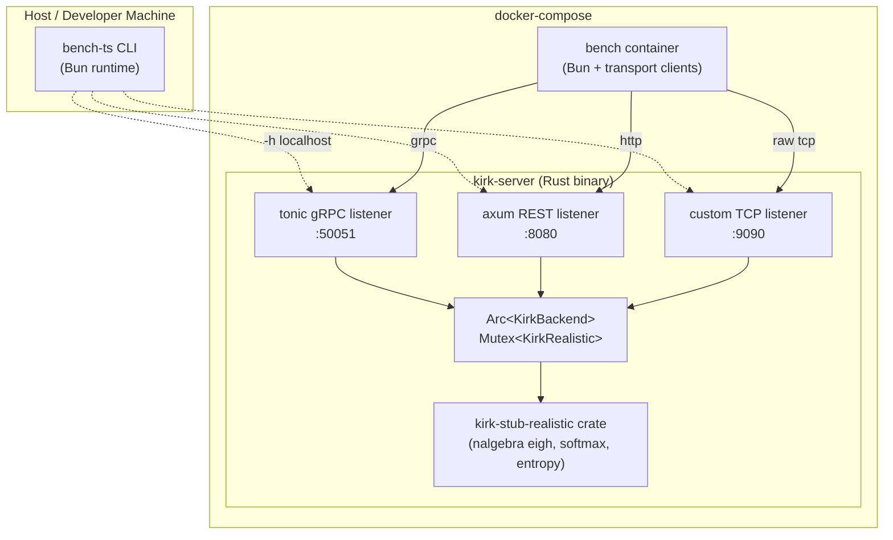
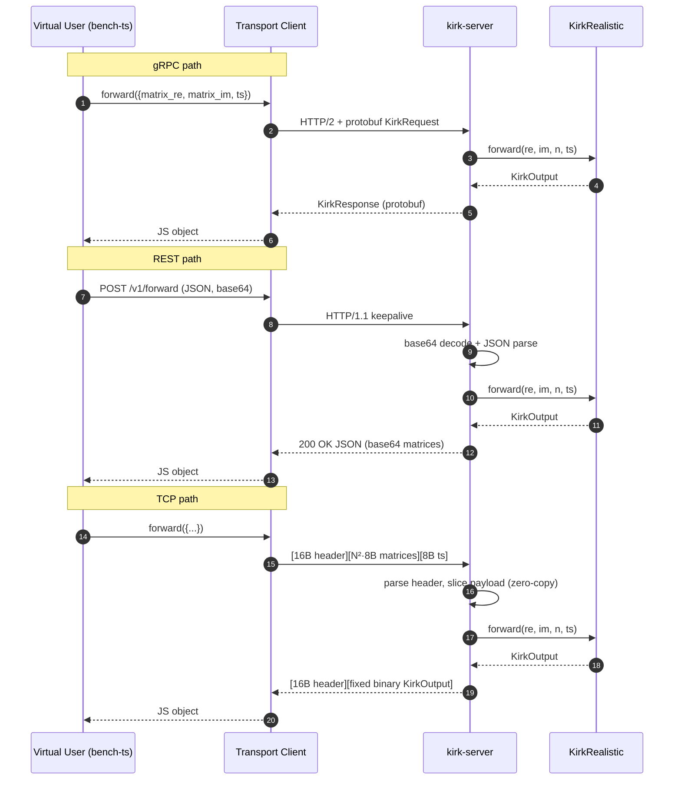

# Specification: Rust Kirk Stub + Multi-Protocol Server + Bun Benchmark Harness

**Author**: architect agent
**Session**: `20260616_201914_kirk-stub-rs-multiproto`
**Worktree**: `/Users/charmalloc/dev/kavara/q/.claude/worktrees/kirk-stub-rs-multiproto/`
**Status**: Spec ready for coder

---

## Summary

Port the Python `kirk-stub-realistic` package (v0.2.3) to a self-contained Rust crate that preserves the six-stage compute pipeline (Hermitianize → eigendecomposition → Boltzmann softmax → density-matrix reconstruction → observables → Shannon entropy) within a documented numerical tolerance vs the numpy reference. Wrap the crate in a single `kirk-server` Rust binary that exposes the same surface on three transports simultaneously — gRPC on 50051 (tonic), REST on 8080 (axum), and a custom length-prefixed binary TCP protocol on 9090 (raw tokio). Build a Bun TypeScript benchmark harness (`bench-ts`) that drives concurrent virtual users against any of the three transports, captures p50/p95/p99 latency and throughput, and supports side-by-side comparison of result files. Package everything in `docker compose` so a single command can spin up the server and a parameterized bench runner. The target ordering, validated by the bench, is **TCP > gRPC > REST**.

---

## Functional Requirements

### kirk-stub-realistic (Rust crate)
- **FR-001**: Crate exposes `KirkRealistic::new(temperature: f32, window_size: usize) -> Result<Self, KirkError>` with the same validation as Python (`temperature > 0`, `window_size >= 1`).
- **FR-002**: Crate exposes `KirkRealistic::forward(&mut self, matrix_re: &[f32], matrix_im: &[f32], n: usize, timestamp_us: i64) -> Result<KirkOutput, KirkError>` matching Python `KirkRealistic.forward` semantics: hermitianize, eigh, Boltzmann, density matrix, Shannon entropy, the two real/imag entropies, rolling z-score over the last `window_size` entropies, regime classification (0/1/2), confidence = `clip(1 - H/ln(N), 0, 1)`, processing time in microseconds.
- **FR-003**: Crate exposes the five Joel-API variant free functions: `inference_entropy(sample) -> f32`, `inference_features(sample) -> (Array2<Complex32>, Array1<Complex32>, Complex32)`, `active_inference(sample) -> (..., ..., ..., f32)`, `active_inference_entropy(sample) -> f32`, `active_inference_features(sample) -> (...)`. Default temperature 1.0. Input is interpreted as `(H_re, H_im=0)` when real, `(sample.re, sample.im)` when complex.
- **FR-004**: Crate exposes `forward_sample(n: usize, rng: &mut impl Rng) -> KirkSampleOutput` returning random complex64 shape-correct outputs (`feature_array` `(N,N)`, `feature_vector` `(2N,)`, `feature_scalar` `Complex32`, `relative_entropy: f32 >= 0`). Mirrors Python `sample.forward_sample`.
- **FR-005**: `KirkOutput` carries all 10 fields from the Python pydantic model: `entropy_re`, `entropy_im`, `entropy`, `entropy_zscore`, `regime`, `confidence`, `processing_time_us`, `timestamp_us`, `matrix_re: Vec<f32>`, `matrix_im: Vec<f32>` (flattened `N*N` row-major, with `matrix_dim` accessor).
- **FR-006**: Crate has `#![no_unsafe]` (`#![forbid(unsafe_code)]`) and compiles with no C dependencies (no LAPACK).
- **FR-007**: Crate includes unit tests verifying: (a) hermitianize round-trip, (b) eigenvalues are real and sum equals trace, (c) `rho.trace() ≈ 1.0`, (d) confidence is within `[0, 1]`, (e) all five variants produce non-NaN outputs for N ∈ {2, 4, 8, 16, 32}.

### kirk-server (Rust binary)
- **FR-010**: Server binary spawns three independent tokio listener tasks sharing one `Arc<KirkBackend>` where `KirkBackend` owns a `Mutex<KirkRealistic>` (or `parking_lot::Mutex`) so the rolling-window state is shared across transports. Variant functions are stateless and can be called concurrently.
- **FR-011**: gRPC service `KirkService` on `0.0.0.0:50051` implements 7 RPCs: `Forward`, `InferenceEntropy`, `InferenceFeatures`, `ActiveInference`, `ActiveInferenceEntropy`, `ActiveInferenceFeatures`, `ForwardSample`. Proto schema is the single source of truth (see API Design).
- **FR-012**: REST service on `0.0.0.0:8080` implements: `POST /v1/forward`, `POST /v1/inference/entropy`, `POST /v1/inference/features`, `POST /v1/active-inference`, `POST /v1/active-inference/entropy`, `POST /v1/active-inference/features`, `POST /v1/forward-sample`, `GET /healthz`, `GET /metrics` (Prometheus text). JSON in/out with base64-encoded little-endian f32 matrices, mirroring `to_kafka_envelope` field names (`matrix_re`, `matrix_im`, `matrix_dim`).
- **FR-013**: Custom TCP service on `0.0.0.0:9090` speaks a length-prefixed framed binary protocol (see API Design). Each TCP connection is its own tokio task using `tokio::io::BufReader`/`BufWriter` with zero-copy `BytesMut` payload handling on the hot path. The server pre-allocates per-connection scratch buffers and reuses them.
- **FR-014**: Server accepts CLI flags via `clap`: `--grpc-port` (default 50051), `--rest-port` (default 8080), `--tcp-port` (default 9090), `--bind` (default `0.0.0.0`), `--workers N` (tokio worker threads, default = num CPUs), `--temperature` (default 1.0), `--window-size` (default 256), `--max-matrix-dim` (default 1024), `--log-level` (default info).
- **FR-015**: Server handles SIGINT/SIGTERM via `tokio::signal` and performs graceful shutdown — stop accepting new connections, drain in-flight requests with a 10-second deadline, then exit 0.
- **FR-016**: All three transports emit structured `tracing` spans labeled `transport={grpc|rest|tcp}` and `op=<opname>` so the server can be observed under load.

### proto/kirk.proto
- **FR-020**: Single proto file at `proto/kirk.proto`, `package kirk.v1`, used by both `tonic-build` (server side) and `protoc-gen-bun` / `@bufbuild/protobuf` (client side). See API Design § gRPC for the schema.

### bench-ts (Bun TypeScript)
- **FR-030**: CLI entry point at `src/cli.ts`, runs under `bun run bench` or `bun src/cli.ts`. Subcommands: `run` (drive a benchmark) and `compare` (diff N result files).
- **FR-031**: `run` flags: `--transport {grpc|rest|tcp}` (required), `--host` (default `localhost`), `--port` (default per-transport), `--users N` (concurrent virtual users, default 10), one of `--duration <human-readable>` (e.g. `60s`, `2m`) OR `--requests N` (total), `--matrix-size N` (default 32), `--temperature` (default 1.0), `--seed <u64>` (default 42), `--warmup <duration>` (default `2s`), `--output <path>` (default `results/<UTC-iso>.json`), `--op` (default `forward`; allowed: `forward`, `inference_entropy`, `inference_features`, `active_inference`, `forward_sample`).
- **FR-032**: Each virtual user is a `Promise` loop that generates one matrix per request (deterministic seeded RNG, splitmix64 + xoshiro256** as the source), submits it to the transport, records `(start_ns, end_ns, ok|err_code, bytes_in, bytes_out)`.
- **FR-033**: Aggregator computes per-transport summary: `requests_total`, `errors_total`, `duration_s`, `throughput_rps`, `latency_ns_{min,p50,p90,p95,p99,p999,max,mean}`, `bytes_in_total`, `bytes_out_total`, `concurrency_actual`. Emits both pretty table (via simple ANSI) and JSON to disk.
- **FR-034**: `compare` subcommand: `bench compare results/a.json results/b.json results/c.json` → prints a side-by-side table with relative deltas (e.g. `tcp p95 = 1.4ms (-67% vs rest)`).
- **FR-035**: Three transport client modules under `src/transports/`:
  - `grpc.ts` uses `@grpc/grpc-js` + `@grpc/proto-loader` (or `@bufbuild/protobuf` + `@connectrpc/connect-node`) to call `KirkService.Forward`.
  - `rest.ts` uses native `fetch` with HTTP keepalive (Bun handles this transparently).
  - `tcp.ts` uses Bun's `Bun.connect()` to open a persistent TCP socket per virtual user, hand-encodes the binary frame using `DataView`, decodes replies, and keeps a `Map<request_id, resolver>` for in-flight RPCs (pipelined).
- **FR-036**: All three transports MUST reuse connections (no per-request handshake) for any meaningful throughput comparison. Document this explicitly in `bench-ts/README.md`.

### docker/
- **FR-040**: `docker/Dockerfile` is a multi-stage build: `rust:1-bookworm` builder, `gcr.io/distroless/cc-debian12` runtime, copies `kirk-server` binary, exposes ports 50051/8080/9090, runs as non-root UID 10001.
- **FR-041**: `docker/Dockerfile.bench` uses `oven/bun:1-alpine`, copies `bench-ts/`, installs deps, entrypoint `["bun", "src/cli.ts"]`.
- **FR-042**: `docker-compose.yml` defines two services:
  - `kirk-server`: builds from `docker/Dockerfile`, exposes 50051/8080/9090, healthcheck `wget -qO- http://localhost:8080/healthz`, restart `unless-stopped`.
  - `bench`: builds from `docker/Dockerfile.bench`, depends_on `kirk-server` (condition: service_healthy), env-driven defaults `TRANSPORT`, `USERS`, `DURATION`, `MATRIX_SIZE`, `OP`, profile `bench` so it does not auto-start with `docker compose up kirk-server`.
- **FR-043**: A `make bench-tcp`, `make bench-grpc`, `make bench-rest`, `make bench-all` convenience set in a top-level `Makefile`.

### Hyper-scaling
- **FR-050**: `kirk-server` uses `tokio::runtime::Builder::new_multi_thread().worker_threads(workers)` driven by `--workers` (default = `num_cpus::get()`).
- **FR-051**: TCP listener tunes `set_nodelay(true)` and disables Nagle. Default `SO_REUSEADDR`. Listener backlog 1024.
- **FR-052**: gRPC server uses tonic's default HTTP/2 keepalive (15s) and configures `max_concurrent_streams = 1024`, `tcp_nodelay(true)`, `tcp_keepalive(Some(Duration::from_secs(30)))`.
- **FR-053**: REST server uses axum on top of `axum::serve` with hyper's default keepalive; document HTTP keepalive expectation in `bench-ts`.

---

## Non-Functional Requirements

- **NFR-001 Numerical parity**: For seeded inputs at N ∈ {8, 16, 32}, Rust outputs must match Python within: `|entropy - entropy_py| / max(1, entropy_py) ≤ 1e-4`, same for `entropy_re` and `entropy_im`; `|confidence - confidence_py| ≤ 1e-4`; `||rho_rust - rho_py||_F / ||rho_py||_F ≤ 1e-3` (Frobenius). Eigenvector sign is **not** compared (gauge ambiguity); compare `rho` only.
- **NFR-002 Throughput ordering**: Under matched conditions (same N, same users, same duration, same host, persistent connections), measured p95 latency MUST satisfy `tcp ≤ grpc ≤ rest` and throughput MUST satisfy `tcp_rps ≥ grpc_rps ≥ rest_rps`. The bench failing this ordering is a regression. Target deltas: TCP at least 30% faster p95 than gRPC; gRPC at least 20% faster p95 than REST, at N=32 with 100 users.
- **NFR-003 Reproducibility**: bench-ts must accept `--seed` and produce identical request payloads for identical seeds. Server is deterministic given identical input (the rolling-window state is the only nondeterminism source and is per-server-instance).
- **NFR-004 Observability**: bench-ts collects all per-request latencies in a `Float64Array` (preallocated to expected size to avoid GC pressure); aggregates use [HdrHistogram-style](https://github.com/HdrHistogram/HdrHistogramJS) or sorted-array percentile (simplicity OK at expected sample sizes ≤ 10M). Server emits `tracing` JSON logs at `info` level by default.
- **NFR-005 Graceful shutdown**: Server completes in-flight requests within 10s of SIGTERM, then exits cleanly. bench-ts handles SIGINT by stopping new requests, draining in-flight, and writing the result file before exiting.
- **NFR-006 Configurable workers**: `--workers` flag honored. Default = `num_cpus::get()`. Document in `kirk-server/README.md`.
- **NFR-007 Cold-start**: Server cold-start from binary execution to "listening on 3 ports" ≤ 500ms on M2/x86_64.
- **NFR-008 Memory**: Per-connection TCP scratch buffer ≤ 8 MB (cap from `--max-matrix-dim`). Server steady-state RSS ≤ 256 MB at 100 concurrent connections, N=32.
- **NFR-009 Portability**: Builds and runs on macOS arm64 (host dev) and linux/amd64 (docker). No GPU. No C/LAPACK deps.

---

## Architecture

### System Design



### Data Flow — single Forward call per transport



---

## API Design

### gRPC — `proto/kirk.proto`

```proto
syntax = "proto3";
package kirk.v1;

service KirkService {
  rpc Forward(KirkRequest) returns (KirkResponse);
  rpc InferenceEntropy(SampleRequest) returns (EntropyResponse);
  rpc InferenceFeatures(SampleRequest) returns (FeaturesResponse);
  rpc ActiveInference(SampleRequest) returns (ActiveInferenceResponse);
  rpc ActiveInferenceEntropy(SampleRequest) returns (EntropyResponse);
  rpc ActiveInferenceFeatures(SampleRequest) returns (FeaturesResponse);
  rpc ForwardSample(SampleSizeRequest) returns (SampleResponse);
}

// Square N×N matrix, row-major, little-endian f32 in `data_re` and `data_im`.
message Matrix {
  uint32 dim = 1;              // N (max 1024)
  bytes data_re = 2;           // 4·N·N bytes
  bytes data_im = 3;           // 4·N·N bytes
}

message KirkRequest {
  Matrix matrix = 1;
  int64 timestamp_us = 2;
}

message ComplexMatrix {
  uint32 dim = 1;
  bytes data_re = 2;
  bytes data_im = 3;
}

message KirkResponse {
  float entropy_re = 1;
  float entropy_im = 2;
  float entropy = 3;
  float entropy_zscore = 4;
  uint32 regime = 5;           // 0/1/2
  float confidence = 6;
  uint64 processing_time_us = 7;
  int64 timestamp_us = 8;
  ComplexMatrix rho = 9;       // rho = matrix_re + i·matrix_im
}

message SampleRequest {
  // Sample is interpreted as complex N×N. Real-only senders set data_im to empty bytes.
  ComplexMatrix sample = 1;
}

message EntropyResponse { float total_relative_entropy = 1; }

message FeatureScalar { float re = 1; float im = 2; }

message FeaturesResponse {
  ComplexMatrix feature_arr = 1;    // (N, N)
  ComplexMatrix feature_vec = 2;    // (1, 2N) packed
  FeatureScalar feature_scalar = 3;
}

message ActiveInferenceResponse {
  ComplexMatrix feature_arr = 1;
  ComplexMatrix feature_vec = 2;
  FeatureScalar feature_scalar = 3;
  float total_relative_entropy = 4;
}

message SampleSizeRequest { uint32 dim = 1; uint64 seed = 2; }

message SampleResponse {
  ComplexMatrix feature_array = 1;
  ComplexMatrix feature_vector = 2;
  FeatureScalar feature_scalar = 3;
  float relative_entropy = 4;
}
```

### REST — `kirk-server/src/rest/routes.rs`

Field names mirror Python `to_kafka_envelope`. All matrices base64-encoded little-endian f32.

**POST `/v1/forward`** — request:
```json
{
  "matrix_re": "QUJDR...==",
  "matrix_im": "QUJDR...==",
  "matrix_dim": 32,
  "timestamp_us": 1718560000000000
}
```
Response:
```json
{
  "entropy_re": 3.41,
  "entropy_im": 3.42,
  "entropy": 3.40,
  "entropy_zscore": 0.0,
  "regime": 1,
  "confidence": 0.018,
  "processing_time_us": 124,
  "timestamp_us": 1718560000000000,
  "matrix_re": "...",
  "matrix_im": "...",
  "matrix_dim": 32
}
```

**POST `/v1/inference/entropy`**, `/v1/inference/features`, `/v1/active-inference`, `/v1/active-inference/entropy`, `/v1/active-inference/features` — request: `{ "sample_re": "...", "sample_im": "...", "matrix_dim": N }`. Response: same shape as gRPC equivalents but JSON.

**POST `/v1/forward-sample`** — request: `{ "matrix_dim": N, "seed": 42 }`.

**GET `/healthz`** — `200 {"status":"ok"}` always, unless shutdown in progress (503).
**GET `/metrics`** — Prometheus text exposition (request counters, latency histogram per route).

Error envelope: `4xx`/`5xx` with `{"error":"<code>","message":"<human>","detail":{...}}`.

### Custom TCP — wire format

**All multi-byte integers and floats: little-endian.** Frame layout:

```
+--------+----+--------+--------+----------+----------+
| magic  | v  | opcode | flags  | req_id   | payload  |  fixed 16-byte header
| u32    | u8 | u8     | u16    | u32      | u32 len  |
+--------+----+--------+--------+----------+----------+
| payload bytes (payload_len)                          |
+------------------------------------------------------+
```

- `magic`: `0x4B49524B` ("KIRK", little-endian byte order on the wire so it reads as `K I R K` → `[0x4B, 0x49, 0x52, 0x4B]`). Reject frame if mismatched.
- `version`: `1`.
- `opcode`:
  - `0x01` FORWARD
  - `0x02` INFERENCE_ENTROPY
  - `0x03` INFERENCE_FEATURES
  - `0x04` ACTIVE_INFERENCE
  - `0x05` ACTIVE_INFERENCE_ENTROPY
  - `0x06` ACTIVE_INFERENCE_FEATURES
  - `0x07` FORWARD_SAMPLE
  - `0xFE` PING (payload empty; response PING with same req_id)
  - `0xFF` ERROR (response only)
- `flags`: bitfield, reserved = 0. Bit 0 reserved for future compression.
- `req_id`: u32 client-chosen correlation id. Server echoes in response.
- `payload_len`: u32 in bytes. Hard cap `64 MiB` (mirrors Python `_MAX_DECODED_BYTES`). Frames exceeding the cap → connection closed with ERROR (code `0x02` PAYLOAD_TOO_LARGE).

**FORWARD request payload**:
```
[u32 dim N][N*N f32 LE matrix_re][N*N f32 LE matrix_im][i64 LE timestamp_us]
```
Total payload bytes = `4 + 4·N·N + 4·N·N + 8 = 12 + 8·N²`.

**FORWARD response payload** (opcode `0x01` echoed):
```
[f32 entropy_re][f32 entropy_im][f32 entropy][f32 entropy_zscore]
[u32 regime][f32 confidence][u64 processing_time_us][i64 timestamp_us]
[u32 dim N][N*N f32 rho_re][N*N f32 rho_im]
```
Fixed prefix 36 bytes + matrix.

**SAMPLE_*** request payload: `[u32 dim N][N*N f32 sample_re][N*N f32 sample_im]`.

**INFERENCE_ENTROPY / ACTIVE_INFERENCE_ENTROPY response payload**: `[f32 total_relative_entropy]`.

**INFERENCE_FEATURES / ACTIVE_INFERENCE_FEATURES response payload**:
```
[u32 N]
[N*N f32 feature_arr_re][N*N f32 feature_arr_im]
[2N  f32 feature_vec_re][2N  f32 feature_vec_im]
[f32 feature_scalar_re][f32 feature_scalar_im]
```

**ACTIVE_INFERENCE response payload**: same as features + trailing `[f32 total_relative_entropy]`.

**FORWARD_SAMPLE request payload**: `[u32 N][u64 seed]`.
**FORWARD_SAMPLE response payload**: same as features + `[f32 relative_entropy]`.

**ERROR response payload**:
```
[u16 error_code][u16 reserved][u32 msg_len][msg_len UTF-8 bytes]
```

**Error codes**:
- `0x01` BAD_MAGIC
- `0x02` PAYLOAD_TOO_LARGE
- `0x03` UNSUPPORTED_VERSION
- `0x04` UNKNOWN_OPCODE
- `0x05` BAD_PAYLOAD (length/shape mismatch)
- `0x06` MATRIX_DIM_EXCEEDED (N > `--max-matrix-dim`)
- `0x07` COMPUTE_ERROR (eigh failed, NaN, etc.)
- `0x08` SHUTDOWN_IN_PROGRESS

**No alignment padding.** Reader must use `read_exact` into a `BytesMut`, then borrow `&[u8]` slices. f32 reads via `f32::from_le_bytes`. The 16-byte header is statically `#[repr(C, packed)]` shape for documentation, but parsed by hand (do not transmute — alignment unsafe).

**Connection lifecycle**: client opens a TCP connection, may pipeline multiple requests (req_ids must differ). Server processes in order arrived (single-threaded per connection task on the read side; compute runs on the multi-threaded tokio runtime via `spawn_blocking` if matrix is large — see ADR-004).

---

## Crate & Workspace Layout

Workspace root: `.claude/worktrees/kirk-stub-rs-multiproto/`.

```
Cargo.toml                   # [workspace] members = ["kirk-stub-realistic", "kirk-server"]
rust-toolchain.toml          # stable
proto/
  kirk.proto
kirk-stub-realistic/
  Cargo.toml
  src/
    lib.rs                   # pub use of all surfaces
    kirk.rs                  # KirkRealistic + forward
    output.rs                # KirkOutput, KirkSampleOutput, error type
    eigensolver.rs           # hermitianize + eigh wrapper (nalgebra)
    density_matrix.rs        # softmax + density matrix
    entropy.rs               # shannon_entropy + entropy_from_hamiltonian
    observables.rs           # expected_energy/magnetization/occupancy
    reconstruct.rs           # rho_to_real_imag
    variants.rs              # 5 Joel-API fns
    sample.rs                # forward_sample
    rng.rs                   # seeded RNG helper
  tests/
    parity.rs                # numerical sanity checks
    fixtures.rs              # canned matrices
kirk-server/
  Cargo.toml
  build.rs                   # tonic-build kirk.proto
  src/
    main.rs                  # clap + runtime + listener spawn
    backend.rs               # KirkBackend (Arc<Mutex<KirkRealistic>>)
    config.rs                # CLI struct
    shutdown.rs              # broadcast + drain
    grpc/
      mod.rs
      service.rs             # tonic impl
    rest/
      mod.rs
      routes.rs              # axum router
      schema.rs              # serde structs + base64 helpers
    tcp/
      mod.rs                 # listener loop
      framing.rs             # header parse/serialize
      handler.rs             # per-connection task
      codec.rs               # opcode → payload struct
    metrics.rs               # prometheus counters/histograms
    error.rs                 # ServerError
docker/
  Dockerfile
  Dockerfile.bench
docker-compose.yml
bench-ts/
  package.json
  bunfig.toml
  tsconfig.json
  src/
    cli.ts
    runner.ts
    compare.ts
    rng.ts                   # seeded xoshiro256**
    matrix.ts                # random Hermitian-friendly matrix gen
    transports/
      grpc.ts
      rest.ts
      tcp.ts
    results.ts               # ResultFile schema + writer
    summary.ts               # percentile aggregator + pretty-printer
  proto/                     # copy of ../proto/kirk.proto (or buf-managed)
  results/                   # gitignored output dir
Makefile
README.md
```

### Crate dependencies

**`kirk-stub-realistic/Cargo.toml`**:
```toml
[dependencies]
nalgebra = { version = "0.33", features = ["complex"] }
num-complex = "0.4"
thiserror = "1"
rand = "0.8"
rand_xoshiro = "0.6"

[dev-dependencies]
approx = "0.5"
```

**`kirk-server/Cargo.toml`**:
```toml
[dependencies]
kirk-stub-realistic = { path = "../kirk-stub-realistic" }
tokio = { version = "1", features = ["full"] }
tonic = "0.12"
prost = "0.13"
axum = { version = "0.7", features = ["json", "macros"] }
hyper = "1"
tower = "0.5"
tower-http = { version = "0.6", features = ["trace", "timeout"] }
bytes = "1"
serde = { version = "1", features = ["derive"] }
serde_json = "1"
base64 = "0.22"
clap = { version = "4", features = ["derive", "env"] }
tracing = "0.1"
tracing-subscriber = { version = "0.3", features = ["json", "env-filter"] }
parking_lot = "0.12"
num_cpus = "1"
thiserror = "1"
anyhow = "1"

[build-dependencies]
tonic-build = "0.12"
```

### Public exports

`kirk_stub_realistic::{KirkRealistic, KirkOutput, KirkSampleOutput, KirkError, forward_sample, inference_entropy, inference_features, active_inference, active_inference_entropy, active_inference_features}`.

---

## Bun bench-ts layout

**`bench-ts/package.json`**:
```json
{
  "name": "kirk-bench",
  "type": "module",
  "scripts": {
    "bench": "bun src/cli.ts",
    "typecheck": "bunx tsc --noEmit"
  },
  "dependencies": {
    "@grpc/grpc-js": "^1.10.0",
    "@grpc/proto-loader": "^0.7.0",
    "@bufbuild/protobuf": "^2.0.0"
  },
  "devDependencies": {
    "typescript": "^5.4.0",
    "@types/node": "^20.0.0",
    "@types/bun": "latest"
  }
}
```

**`bench-ts/src/cli.ts`** — `parseArgs` from `node:util` (Bun-compatible). Dispatches to `runner.ts::run` or `compare.ts::compare`.

**`bench-ts/src/runner.ts`** — main loop:
```ts
async function run(opts: RunOptions): Promise<ResultFile> {
  const transport = await openTransport(opts);
  await warmup(transport, opts);
  const latencies = new Float64Array(estimateCapacity(opts));
  let errors = 0;
  const tasks = Array.from({ length: opts.users }, (_, i) => userLoop(i, transport, latencies, opts));
  await Promise.all(tasks);
  return summarize(latencies, errors, opts);
}
```

**`bench-ts/src/transports/tcp.ts`** — outline:
```ts
const HEADER_LEN = 16;
const MAGIC = 0x4B49524B;
export class TcpClient {
  private socket: TcpSocket;
  private pending = new Map<number, (buf: Uint8Array, op: number) => void>();
  private nextReqId = 1;
  async forward(matrix: MatrixF32, ts: bigint): Promise<KirkOutput> { /* ... */ }
}
```

**`bench-ts/src/transports/rest.ts`** — `fetch(`${base}/v1/forward`, { method: "POST", headers: { "content-type": "application/json", "connection": "keep-alive" }, body: JSON.stringify(envelope) })`.

**`bench-ts/src/transports/grpc.ts`** — load `kirk.proto`, construct `KirkService` client, call `forward` with a callback wrapped in a Promise.

---

## Docker compose layout

**`docker-compose.yml`**:
```yaml
version: "3.9"
services:
  kirk-server:
    build:
      context: .
      dockerfile: docker/Dockerfile
    image: kirk-server:dev
    container_name: kirk-server
    ports:
      - "50051:50051"
      - "8080:8080"
      - "9090:9090"
    environment:
      RUST_LOG: info
      KIRK_WORKERS: 0  # 0 = num_cpus
      KIRK_TEMPERATURE: "1.0"
    healthcheck:
      test: ["CMD", "wget", "-qO-", "http://localhost:8080/healthz"]
      interval: 2s
      timeout: 1s
      retries: 10
    restart: unless-stopped

  bench:
    build:
      context: .
      dockerfile: docker/Dockerfile.bench
    image: kirk-bench:dev
    profiles: ["bench"]
    depends_on:
      kirk-server:
        condition: service_healthy
    environment:
      TRANSPORT: ${TRANSPORT:-tcp}
      USERS: ${USERS:-50}
      DURATION: ${DURATION:-30s}
      MATRIX_SIZE: ${MATRIX_SIZE:-32}
      OP: ${OP:-forward}
    command:
      - "run"
      - "--transport=${TRANSPORT:-tcp}"
      - "--host=kirk-server"
      - "--users=${USERS:-50}"
      - "--duration=${DURATION:-30s}"
      - "--matrix-size=${MATRIX_SIZE:-32}"
      - "--op=${OP:-forward}"
      - "--output=/results/${TRANSPORT:-tcp}-${MATRIX_SIZE:-32}.json"
    volumes:
      - ./bench-ts/results:/results
```

Run examples:
```
docker compose up -d kirk-server
TRANSPORT=tcp  USERS=100 DURATION=30s MATRIX_SIZE=32 docker compose run --rm bench
TRANSPORT=grpc USERS=100 DURATION=30s MATRIX_SIZE=32 docker compose run --rm bench
TRANSPORT=rest USERS=100 DURATION=30s MATRIX_SIZE=32 docker compose run --rm bench
```

Then on host: `bun bench-ts/src/cli.ts compare bench-ts/results/*.json`.

---

## Technology Decisions

| Decision | Choice | Rationale |
|----------|--------|-----------|
| Eigendecomp | `nalgebra::SymmetricEigen` on complex Hermitian | Pure Rust, no LAPACK system dep, ships in `nalgebra` 0.33. ADR-001. |
| REST framework | `axum` 0.7 | tokio-native, hyper-based, ergonomic, easier to combine with the same runtime as TCP and tonic. ADR-002. |
| gRPC | `tonic` 0.12 | Canonical Rust gRPC, integrates cleanly with axum on same hyper version. ADR-003. |
| TCP framing | Custom 16-byte fixed header + raw little-endian payload | Removes all protobuf/HTTP overhead; layout designed for `read_exact` into `BytesMut` with zero allocation per request beyond the payload buffer. ADR-004. |
| Bench runtime | Bun | Native fast HTTP/fetch, native TCP via `Bun.connect()`, fast startup, TypeScript no-compile. ADR-005. |
| Compose shape | Two services + `bench` profile | bench-ts is opt-in (does not auto-start), allowing `docker compose up kirk-server` for ad-hoc host benches. ADR-006. |
| Concurrency model | tokio multi-thread runtime, `spawn_blocking` for N ≥ 128 eigh | eigh is CPU-bound; offloading large jobs keeps reactor responsive. ADR-007. |

### ADR-001: nalgebra vs ndarray + LAPACK for eigh

- **Status**: Accepted.
- **Context**: Python uses `numpy.linalg.eigh` on `complex64`. We need a Hermitian complex eigendecomposition in Rust that returns `(λ: Vec<f32>, V: Matrix<Complex32>)`. Options: (a) `ndarray` + `ndarray-linalg` with `openblas-system` or `intel-mkl-system` backend; (b) `nalgebra::linalg::SymmetricEigen` over `Complex<f32>`; (c) FFI to numpy via PyO3 (rejected, defeats the point).
- **Decision**: Use `nalgebra` 0.33's `SymmetricEigen`. It is pure Rust, has no system deps, and works on a `Matrix<Complex32, Dyn, Dyn>` reinterpreted as a real symmetric matrix of dimension `2N` via the standard `[[Re(H), -Im(H)], [Im(H), Re(H)]]` block trick (each eigenvalue appears twice; take every other one).
- **Consequences**: Slightly slower than LAPACK for large N. Acceptable because (a) bench primarily measures transport overhead, not eigh, and (b) the 2N×2N real symmetric trick is well-documented and stable. If profiling later shows eigh as the bottleneck, swap in `faer` 0.19 (also pure Rust) — interface is similar.

### ADR-002: axum vs actix-web for REST

- **Status**: Accepted.
- **Context**: Need a REST framework on the same tokio runtime as tonic.
- **Decision**: axum. tonic also uses hyper/tower; one shared dependency tree. axum-0.7 + hyper-1 is current.
- **Consequences**: actix-web has higher single-thread throughput but its own runtime. Mixing actix with tokio doubles thread pools and complicates shutdown. axum is the right shape for this server.

### ADR-003: tonic for gRPC

- **Status**: Accepted.
- **Context**: gRPC server in Rust.
- **Decision**: tonic 0.12 with prost 0.13.
- **Consequences**: Standard choice. Generates idiomatic service traits. Pairs naturally with axum on hyper-1.

### ADR-004: Custom binary frame design

- **Status**: Accepted.
- **Context**: Need to outperform gRPC and REST on raw throughput. gRPC has HPACK + HTTP/2 framing + protobuf varints. REST has HTTP headers + JSON + base64. We want to strip all of that.
- **Decision**: Fixed 16-byte little-endian header followed by raw f32 payload. No varints. No per-field tags. No length-prefixed sub-fields inside the payload (length is the whole payload). Matrices are sent raw (host endianness assumed little-endian, which is true on all targets we ship to).
- **Consequences**:
  - Pro: zero parsing overhead beyond `read_exact(16)` + `read_exact(payload_len)`. The matrix can be borrowed as `&[f32]` via `bytemuck::cast_slice` (with alignment check) or copied into a `Vec<f32>` if alignment is unsuitable. Either way no per-element decode.
  - Pro: response writing is similarly direct.
  - Pro: pipeline-friendly (`req_id` correlation), persistent connection.
  - Con: not human-debuggable. We will ship an `examples/hex-dump.rs` to help.
  - Con: locks us to little-endian platforms — explicitly documented (NFR-009 already restricts targets to macOS arm64 + linux amd64, both LE).
  - Con: no built-in versioning beyond the `version` byte; future evolution requires a new opcode or version bump.

### ADR-005: Bun vs Node for the bench harness

- **Status**: Accepted.
- **Context**: Need a fast HTTP/gRPC/TCP client harness with low GC pressure and fast startup.
- **Decision**: Bun.
- **Consequences**: Bun's `fetch` and `Bun.connect()` are both lower-overhead than Node equivalents, beneficial for not making the harness itself the bottleneck. `@grpc/grpc-js` runs on Bun (uses the Node compat layer). If a `@grpc/grpc-js` Bun incompatibility surfaces, fall back to `@connectrpc/connect-node` which is pure JS.

### ADR-006: docker-compose service shape

- **Status**: Accepted.
- **Context**: One server, multiple bench runs.
- **Decision**: bench is its own service behind the `bench` profile so it does not auto-start. Parameters via env vars; results bind-mounted to host `bench-ts/results/`. Server runs as a long-lived service with healthcheck.
- **Consequences**: Single-command repeatable runs (`TRANSPORT=tcp docker compose run --rm bench`). Server stays up across runs (eliminates cold-start noise).

### ADR-007: spawn_blocking threshold

- **Status**: Accepted.
- **Context**: Eigendecomposition is CPU-bound. For small N (≤ 64) the work is sub-millisecond and tokio's reactor can absorb it inline. For large N (≥ 128) work can hit 10+ ms, starving the reactor.
- **Decision**: All transports route the call through `spawn_blocking` when `N >= 128`; otherwise call inline.
- **Consequences**: Predictable tail latency under high concurrency at large N. One extra context switch per request at large N (acceptable; eigh dominates).

---

## Security Considerations

- **S-001 DoS via giant matrices**: Cap `--max-matrix-dim` at 1024 by default, configurable up to 4096. Reject larger frames at the framing layer with explicit error codes (gRPC `INVALID_ARGUMENT`, REST `413 Payload Too Large`, TCP `0x06 MATRIX_DIM_EXCEEDED`).
- **S-002 base64 decode bound**: REST handler refuses any base64 payload that decodes to more than 64 MiB (mirrors Python `_MAX_DECODED_BYTES`).
- **S-003 TCP framing length cap**: 64 MiB ceiling on `payload_len`. Exceeding closes the connection after writing an ERROR frame.
- **S-004 prost recursion limit**: tonic's default is fine for the flat schemas here; document the choice.
- **S-005 No auth required**: Out of scope (see Out of Scope). Server documents this prominently. Default bind is `0.0.0.0` because docker-compose requires it, but a `--bind 127.0.0.1` option is provided and recommended for host runs. README warns against exposing the server to public networks.
- **S-006 No TLS**: Out of scope. README documents that TLS termination should be done by a reverse proxy (nginx, envoy) if needed.
- **S-007 Resource limits in container**: `docker-compose.yml` sets default memory limit of 1 GB on `kirk-server` to bound runaway allocations.
- **S-008 Logging**: Server does not log matrix contents. Only sizes and timing.

---

## Constraints

- Builds on macOS arm64 (host development) and linux/amd64 (docker image).
- No GPU. No CUDA. No MPI.
- No system LAPACK / BLAS dependency (must build on a clean machine with only `cargo` + `bun` + Docker).
- No real Kirk weights — the eigendecomposition + softmax + Shannon stays as the documented numerical kernel.
- All endianness assumptions are little-endian. Document this in the TCP spec and the README.

---

## Out of Scope

- **Authentication / authorization**. No API keys, no JWT, no mTLS. Documented as future work in `kirk-server/README.md`.
- **TLS**. Plain HTTP/1.1, plain HTTP/2 (h2c), plain TCP. Add a reverse proxy externally if needed.
- **Kafka streaming integration** (Python `streaming.py` is not ported).
- **Python `cli.py` benchmark subcommand** — replaced by `bench-ts`. Do not port.
- **Real Kirk inference / weight update**. The "active" variants run the same compute as the static ones (matches Python stub semantics).
- **GPU acceleration**.
- **Multi-tenant rolling-window state**. The `KirkRealistic.forward` rolling window is process-wide; if a tenant boundary is later needed, switch the backend to `Arc<DashMap<TenantId, Mutex<KirkRealistic>>>` (document as future work).

---

## Numerical Parity Strategy

The test agent will validate parity as follows:

1. **Reference fixtures**: Python script (one-off, run by hand) generates 5 seeded inputs at N ∈ {8, 16, 32}, runs them through `KirkRealistic.forward`, and dumps `(matrix_re, matrix_im, expected_output)` to `kirk-stub-realistic/tests/fixtures/<seed>_<N>.json`. The seed is fixed (e.g. 42) and the script is checked in for reproducibility.
2. **Rust test**: `kirk-stub-realistic/tests/parity.rs` loads each fixture, calls `KirkRealistic::forward`, and asserts:
   - `|entropy - entropy_py| / max(1, |entropy_py|) ≤ 1e-4`
   - `|entropy_re - entropy_re_py| / max(1, |entropy_re_py|) ≤ 1e-4` (same for `entropy_im`)
   - `|confidence - confidence_py| ≤ 1e-4`
   - `regime == regime_py` (with the same single-shot history — feed the same sequence)
   - **Density matrix Frobenius**: `||rho_rust - rho_py||_F / ||rho_py||_F ≤ 1e-3` (rho is sign-invariant since `V D V†` collapses eigenvector sign). Do **not** compare eigenvectors.
3. **Rolling-window state**: Feed the same sequence of 32 matrices through both implementations and compare every output. Tolerance same as above for entropy/entropy_zscore.
4. **Variant parity**: `inference_entropy`, `active_inference_entropy` are scalar-out; assert relative tolerance 1e-4. `inference_features` returns matrices; compare Frobenius norm of `feature_arr` (≈ rho) at 1e-3.

If the Python parity script cannot be run from the worktree (because the worktree is the Rust project), the test agent can either (a) shell out to `uv run` against the Python source tree at `/Users/charmalloc/dev/kavara/kirk-stub-realistic/` to regenerate fixtures, or (b) check in pre-generated fixture files. Recommend (b) for hermetic testing.

---

## Open Questions

1. **Should rho be returned over the wire?** Python returns the full `(matrix_re, matrix_im)` density matrix in `KirkOutput`. For large N this dominates the response payload. **Suggested answer**: keep it (parity matters more than bandwidth for now); add an optional `--no-rho` server flag and a request-side `include_rho: bool` flag in a future iteration.
2. **Should the rolling-window state be shared across the three transports or per-transport?** Sharing is closer to "single server instance" semantics; per-transport gives cleaner bench isolation. **Suggested answer**: shared (one `Mutex<KirkRealistic>`). Document the lock contention in the bench README — for `forward` the lock is held only for the rolling-window update (microseconds), not the eigh. Variant fns are stateless and not affected.
3. **Bun gRPC client choice**: `@grpc/grpc-js` or `@connectrpc/connect-node`? **Suggested answer**: start with `@grpc/grpc-js` (most familiar API); if Bun-incompat surfaces, switch to `@connectrpc/connect-node` (pure JS, no native deps).
4. **Should TCP support multiple in-flight requests per connection (pipelining)?** **Suggested answer**: yes — bench-ts pipelines and server processes in arrival order. This is what makes TCP win — gRPC pipelines streams natively, REST does not (without HTTP/2 multiplexing, which axum's HTTP/1.1 keepalive does not give us). For honest comparison, document each transport's pipelining model in the bench README.
5. **Matrix randomization in bench-ts**: should each request use a fresh matrix or reuse one? **Suggested answer**: fresh matrix per request, but pre-generated into a circular buffer of N=1024 matrices at startup so generation cost is excluded from the steady-state loop. Document the warmup phase that fills this buffer.
6. **Should we measure cold-start latency separately from steady-state?** **Suggested answer**: yes — bench-ts has a `--warmup` flag (default `2s`) whose results are discarded. Steady-state numbers only after warmup.

---

## Implementation Notes for the Coder

- The coder should create everything inside the worktree at `/Users/charmalloc/dev/kavara/q/.claude/worktrees/kirk-stub-rs-multiproto/`. The repo root has nothing else relevant.
- Start with `kirk-stub-realistic/` and write the parity tests first (TDD-friendly). Once parity passes, move to `kirk-server/`.
- Implement transports in this order: REST (easiest, JSON gives quick visibility) → gRPC (proto wiring) → TCP (most subtle).
- For the TCP server, write the framing parser as a pure function `parse_header(&[u8]) -> Result<Header, FramingError>` and unit-test it with hand-crafted bytes (round-trip, truncated frame, bad magic, version mismatch, too-large payload).
- `bench-ts` should validate that `process.versions.bun` is defined and refuse to run on plain Node (the TCP transport uses `Bun.connect`).
- Add a top-level `README.md` documenting how to run end-to-end: `docker compose up -d kirk-server; TRANSPORT=tcp docker compose run --rm bench`.
- The coder should NOT add authentication, TLS, or any feature listed under Out of Scope.
