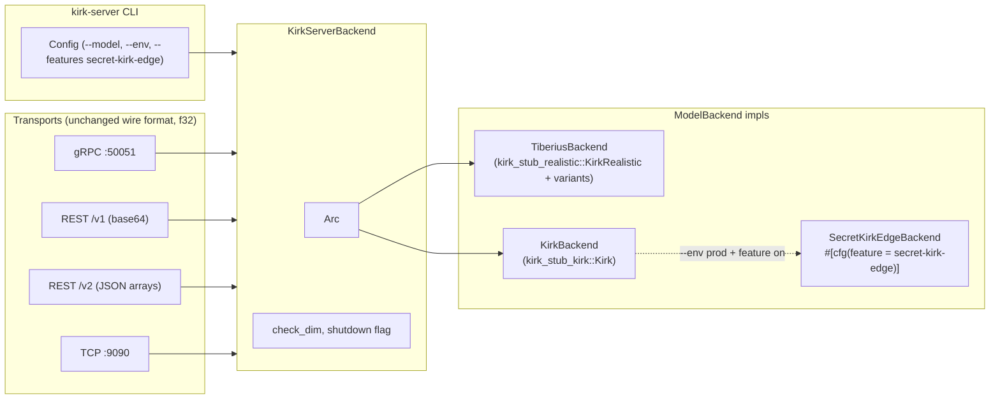
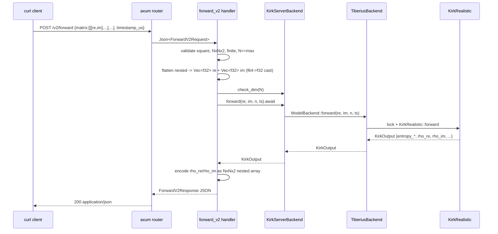

# Specification: Tiberius / Kirk Multi-Model Selector, --env Guard, REST v2

**Author**: architect agent
**Session**: `20260620_131449_tiberius-kirk-multimodel-v2`
**Status**: Proposed — ready for implementation
**Worktree**: `/Users/charmalloc/dev/kavara/q/.claude/worktrees/tiberius-kirk-multimodel-v2`

---

## Summary

This spec covers four coordinated changes to the `kirk-server` multi-protocol Rust workspace. (1) The existing `kirk-stub-realistic` Boltzmann/Shannon Hermitian-eigh kernel is conceptually re-labelled **tiberius** (no crate rename, just a model-selector alias). (2) A new sibling crate `kirk-stub-kirk` is added, exposing a stateful `Kirk` struct built with `bon::Builder` and a five-method public surface using `ndarray` + `num_complex::Complex64`; the five public methods are shape-correct deterministic stubs (no LAPACK, no "active inference" math). (3) `kirk-server` gains a `--model {tiberius,kirk}` runtime selector via a new `trait ModelBackend: Send + Sync` and two adapter impls; transports are unchanged on the wire and continue to use the existing `Complex32`/f32 surface. (4) `kirk-server` gains a `--env {local,prod}` flag and an optional Cargo feature `secret-kirk-edge` that, when built ON, enables the prod variant of the kirk backend by linking a private crate; CI and Docker MUST NOT enable this feature. (5) REST gains a parallel `/v2/` route group whose request and response shapes use nested JSON arrays of `[re, im]` pairs (no base64) — v1 stays bit-for-bit unchanged.

Backward-compat is preserved end-to-end: the default `--model tiberius --env local` invocation, with no feature flags, behaves exactly as `kirk-server` does today on every transport and every v1 route.

---

## Requirements

### Functional Requirements

#### Model selector & two stubs

- **FR-001** Add a new workspace crate `kirk-stub-kirk` containing a public struct `Kirk` built with `bon::Builder`, exposing exactly five public methods with the signatures listed in §"`kirk-stub-kirk` crate spec". No other public functions or types are required.
- **FR-002** The five public methods MUST produce **shape-correct, finite, deterministic-given-input** output. They MUST NOT call any of the helper functions `construct_hidden_activations`, `construct_hamiltonian`, `construct_density_matrix`, `construct_observeable`, `calculate_entropy`, `calculate_features`, `update_weights`, `init_rho_hat` from the pasted prototype — those helpers MUST be DELETED from the source.
- **FR-003** The bon::Builder skeleton (struct field set, attribute order, the `impl<S: kirk_builder::IsComplete> KirkBuilder<S>::build()` custom builder, the `Default` impl, and the `pub fn new() -> Kirk` convenience constructor) MUST be preserved exactly as in the pasted prototype. Only the bodies of the five public stateful methods change, and the eight private helper functions are removed.
- **FR-004** Add a `pub use kirk_stub_realistic as tiberius;` (or an equivalent alias module) so downstream code can refer to the existing Boltzmann/Shannon kernel by the "tiberius" name without a hard crate rename. The crate name `kirk-stub-realistic` does not change.
- **FR-005** Add a new flag `--model {tiberius,kirk}` to `kirk-server/src/config.rs` (env `KIRK_MODEL`, default `tiberius`). Invalid values exit with clap's standard error (exit 2).
- **FR-006** Introduce `trait ModelBackend: Send + Sync` in `kirk-server/src/backend.rs` (or a new `model.rs` submodule) carrying the existing wire-facing surface (see §"`trait ModelBackend` design").
- **FR-007** Implement `TiberiusBackend` that wraps `KirkRealistic` and `forward_sample` + the five `variants::*` free functions — i.e. exactly today's behavior — behind the trait. The trait's `forward` uses `parking_lot::Mutex<KirkRealistic>` for state, matching today's `KirkBackend.kirk: Mutex<KirkRealistic>` (so rolling-window state survives across calls per-transport-process exactly as before).
- **FR-008** Implement `KirkBackend` (the kirk variant, not to be confused with today's `KirkBackend` struct which becomes `KirkServerBackend` or stays as the wrapper) that wraps `kirk_stub_kirk::Kirk` behind the trait. Stateful methods convert at the boundary: `f32 → f64 → Complex64` on input, `Complex64 → f32` on output.
- **FR-009** Rename today's `pub struct KirkBackend` in `kirk-server/src/backend.rs` to `pub struct KirkServerBackend` (the transport-facing wrapper holding `Arc<dyn ModelBackend>`, `max_matrix_dim`, `shutdown`). Re-export it as `pub use KirkServerBackend as KirkBackend;` for type compatibility so the rest of the codebase (rest/routes.rs, grpc/service.rs, tcp/handler.rs) does not need to be touched at the call site. Alternatively, leave the type name `KirkBackend` and just change its internals — implementer's choice; the constraint is that transport code at the call site does not change names.
- **FR-010** `KirkServerBackend::new` takes a `Box<dyn ModelBackend>` (or similar constructor function) selected by `Config::model`. The transport-facing methods (`forward`, `inference_entropy`, `inference_features`, `active_inference`, `active_inference_entropy`, `active_inference_features`, `forward_sample`) keep their existing async signatures and delegate to the trait via `Arc<dyn ModelBackend>`.
- **FR-011** All three transports (gRPC, REST v1, REST v2, TCP) MUST route through `KirkServerBackend` and therefore through the trait. No transport code adds a second dispatch point or special-cases the model. The bench-ts harness needs no changes.

#### --env flag + secure-build feature

- **FR-012** Add `--env {local,prod}` flag to `Config` (env `KIRK_ENV`, default `local`).
- **FR-013** Add a Cargo feature `secret-kirk-edge` on `kirk-server` (default OFF) with an optional dep on `secret-kirk-edge = { git = "https://git-kavara.ibis-allosaurus.ts.net/kavara-ai/secret-kirk-edge-v2.git", optional = true }`. The feature gates compilation of `kirk-server/src/secret_edge.rs`, a module that constructs a `SecretKirkEdgeBackend: ModelBackend` from the private crate.
- **FR-014** Runtime guard, evaluated in `main.rs` after `Config::parse`:
  - `--env local` (default): always allowed. Use the local stub for whichever `--model` is selected.
  - `--env prod` + feature OFF: exit code 2, stderr `"--env prod requires a build with --features secret-kirk-edge; see docs/SECURE_BUILD.md"`. Do not start any listener.
  - `--env prod` + feature ON + `--model kirk`: instantiate `SecretKirkEdgeBackend` (the secret-kirk-edge variant).
  - `--env prod` + feature ON + `--model tiberius`: allowed. Use the local `TiberiusBackend` (Tiberius has no "real" implementation; prod is a no-op upgrade for tiberius and is documented as such).
- **FR-015** When the `secret-kirk-edge` feature is OFF (the default), the secret-kirk-edge git URL MUST NOT appear in the resolved `Cargo.toml` dependency tree, `Cargo.lock`, the compiled binary, or any log/`--version` string. The dep is `optional = true`, which keeps it out of `Cargo.lock` resolution when the feature is off, by Cargo's design. Verified by a CI assertion (`scripts/check-no-secret-edge.sh`).
- **FR-016** The Docker build (`docker/Dockerfile`) MUST NOT pass `--features secret-kirk-edge`. CI MUST NOT build with the feature on. The README + `docs/SECURE_BUILD.md` document the manual build path for operators.

#### REST /v2 JSON-array endpoints

- **FR-017** Add seven new POST routes mirroring v1, parented under `/v2/`:
  - `POST /v2/forward`
  - `POST /v2/inference/entropy`
  - `POST /v2/inference/features`
  - `POST /v2/active-inference`
  - `POST /v2/active-inference/entropy`
  - `POST /v2/active-inference/features`
  - `POST /v2/forward-sample`
  v1 routes stay registered unchanged.
- **FR-018** v2 request body for matrix-bearing endpoints (`forward`, `inference/*`, `active-inference/*`) accepts JSON of the shape:
  ```json
  {
    "matrix": [
      [[1.0, 0.0], [0.0, 0.0]],
      [[0.0, 0.0], [-1.0, 0.0]]
    ],
    "timestamp_us": 0
  }
  ```
  Server validates: `matrix.length == matrix[0].length == N`, every row has length `N`, every innermost array has exactly 2 floats, every float is finite (`!is_nan() && is_finite()`), `2 <= N <= max_matrix_dim`. `timestamp_us` defaults to `0`. There is no `sample_re`/`sample_im` field — both real and imaginary parts come from the nested pair.
- **FR-019** v2 forward-sample request body: `{"matrix_dim": N, "seed": u64}` (same as v1's `SampleSizeRequest`; no matrix is sent).
- **FR-020** v2 response shapes:
  - `/v2/forward` returns `{entropy_re, entropy_im, entropy, entropy_zscore, regime, confidence, processing_time_us, timestamp_us, matrix}` — `matrix` is the same nested-array shape as the request matrix; `matrix_dim` is OMITTED (derivable from `matrix.length`).
  - `/v2/inference/entropy` and `/v2/active-inference/entropy` return `{"total_relative_entropy": f64}`.
  - `/v2/inference/features`, `/v2/active-inference/features` return `{"feature_arr": NxNx2 nested, "feature_vec": 2Nx2 nested, "feature_scalar": [re, im]}`. No `matrix_dim` field.
  - `/v2/active-inference` returns the features fields plus `total_relative_entropy`.
  - `/v2/forward-sample` returns `{"feature_array": NxNx2 nested, "feature_vector": 2Nx2 nested, "feature_scalar": [re, im], "relative_entropy": f64}`. No `matrix_dim` field.
- **FR-021** v2 error envelope is identical to v1's `ErrorResponse` (`{error, message}`), produced by the same `ServerError::http_status()` / `code()` mapping. Validation failures specific to v2 (jagged rows, inner pair wrong length, non-finite, etc.) map to `ServerError::BadRequest(...)` → 400.
- **FR-022** v2 uses the same 64 MiB body cap (`REST_BODY_LIMIT_BYTES`) as v1. Per-request shape validation is applied **after** parsing succeeds; therefore practical max-N for v2 ≈ 300 (much smaller than v1's ≈ 1024) at the 64 MiB cap. Document this practical ceiling in `docs/REST.md`.
- **FR-023** v2 internally converts to the existing kernel's f32 surface for **tiberius** (truncating f64 → f32 at the boundary) and feeds f64 directly to **kirk** (which natively uses Complex64). The conversion happens inside the v2 route handler before calling the trait method. The trait method signatures themselves stay f32 to keep transport contracts uniform across REST v1, gRPC, and TCP.

### Non-Functional Requirements

- **NFR-001 (parity)** With `--model tiberius --env local` and v1 routes only, the server MUST be byte-for-byte identical to today's behavior on every existing integration test and parity fixture in `kirk-stub-realistic/tests/fixtures/`.
- **NFR-002 (performance, measure-only)** v2 endpoints will be slower than v1 for the same matrix (JSON parsing + f64 conversion + extra allocation for the nested-array structure). This is expected and NOT a regression gate — we measure but do not block on a specific ratio. Target: v2 forward at N=128 within 5× v1 forward at p95 on the existing bench harness. If we exceed 10×, open a follow-up issue.
- **NFR-003 (security)** `--env prod` MUST NOT start any listener when the binary lacks the `secret-kirk-edge` feature. The error message MUST NOT include the private git URL. Secret URL MUST NEVER appear in `--version`, in tracing logs, or in `/metrics` output. `Cargo.lock` MUST NOT reference the secret crate when built without the feature.
- **NFR-004 (memory safety)** All new code is `#![forbid(unsafe_code)]`. New `kirk-stub-kirk` crate inherits this forbid.
- **NFR-005 (testability)** Every new public API has at least one direct test. Specifically: (a) `Kirk::active_inference` etc. have shape/finite/determinism tests; (b) the `ModelBackend` dispatcher has a tiny mock-impl test asserting the right backend is constructed for each `--model` value; (c) v2 routes have a round-trip test (build a matrix → POST to v2 → POST the same matrix to v1 base64-encoded → compare numeric fields within tiberius backend tolerance).
- **NFR-006 (observability)** Prometheus metrics emitted by v2 routes MUST be tagged distinctly from v1 (`op = "forward_v2"` etc.) so operators can separate the two cohorts.
- **NFR-007 (no LAPACK)** The `kirk-stub-kirk` crate MUST compile without any LAPACK backend. It does not depend on `ndarray-linalg`.

---

## Architecture

### Component diagram



### Sequence diagram: REST /v2/forward call (tiberius backend)



### Sequence diagram: REST /v2/forward call (kirk backend, --env local)

```mermaid
sequenceDiagram
    participant C as curl client
    participant H as forward_v2 handler
    participant B as KirkServerBackend
    participant K as KirkBackend (model)
    participant S as kirk_stub_kirk::Kirk

    C->>H: POST /v2/forward (NxNx2 f64 nested)
    H->>H: validate; flatten nested -> Vec<f32> re/im (lossy cast for trait)
    H->>B: forward(re, im, n, ts)
    B->>K: ModelBackend::forward
    K->>K: f32 re/im -> Array2<Complex64> (lift)
    K->>S: kirk.active_inference(view) (chosen as the forward analog)
    S-->>K: (Array2<C64>, Array1<C64>, C64, f64)
    K->>K: convert array -> KirkOutput (matrix_re/im as f32 via cast)
    K-->>B: KirkOutput
    B-->>H: KirkOutput
    H-->>C: ForwardV2Response (f64 in nested array)
```

### API design (concise; full v2 schemas in §"REST /v2 API")

- `/v1/*` — unchanged base64 LE f32 envelopes.
- `/v2/forward` — nested f64 `[re,im]` request and response.
- All v1 + v2 share the `ErrorResponse` envelope and HTTP status mapping.

---

## `trait ModelBackend` design

```rust
// kirk-server/src/model.rs (new file)
use crate::error::ServerError;
use kirk_stub_realistic::{KirkOutput, KirkSampleOutput};
use kirk_stub_realistic::variants::{ActiveInferenceOut, Features};

/// Wire-facing surface shared by Tiberius and Kirk.
///
/// All methods are synchronous and CPU-bound. The caller
/// (`KirkServerBackend`) decides whether to dispatch via
/// `tokio::task::spawn_blocking` based on `SPAWN_BLOCKING_THRESHOLD`.
///
/// Implementors hold their own state internally via interior mutability
/// (TiberiusBackend uses `parking_lot::Mutex<KirkRealistic>`; KirkBackend
/// uses `parking_lot::Mutex<kirk_stub_kirk::Kirk>`). The trait surface is
/// stateless from the caller's perspective.
pub trait ModelBackend: Send + Sync {
    fn name(&self) -> &'static str;

    fn forward(
        &self,
        matrix_re: &[f32],
        matrix_im: &[f32],
        n: usize,
        timestamp_us: i64,
    ) -> Result<KirkOutput, ServerError>;

    fn inference_entropy(&self, re: &[f32], im: &[f32], n: usize) -> Result<f32, ServerError>;
    fn inference_features(&self, re: &[f32], im: &[f32], n: usize) -> Result<Features, ServerError>;
    fn active_inference(&self, re: &[f32], im: &[f32], n: usize) -> Result<ActiveInferenceOut, ServerError>;
    fn active_inference_entropy(&self, re: &[f32], im: &[f32], n: usize) -> Result<f32, ServerError>;
    fn active_inference_features(&self, re: &[f32], im: &[f32], n: usize) -> Result<Features, ServerError>;
    fn forward_sample(&self, n: usize, seed: u64) -> Result<KirkSampleOutput, ServerError>;
}
```

**Ownership**: `KirkServerBackend` holds `Arc<dyn ModelBackend>`. Cloned across `tokio::task::spawn_blocking` boundaries via the existing `me = self.clone()` pattern. No new locks; the trait impl encapsulates its own mutex.

**Error type**: reuse `ServerError`. The kirk stub uses `ServerError::Compute(KirkError::...)` for shape mismatches by converting from its own internal error type into `KirkError` (or by mapping directly to `ServerError::BadRequest`). The kirk stub will not produce `KirkError::EigenFailure` since it does no eigendecomposition; that variant remains tiberius-only.

**Trait choice rationale (see ADR-001)**: We use a trait object (`Arc<dyn ModelBackend>`) rather than an enum variant per backend because the secret-kirk-edge variant is `cfg`-gated and we want a clean compile-time exclusion when the feature is off without `#[cfg(feature)]` arms inside `enum BackendVariant`.

---

## `kirk-stub-kirk` crate spec

### Cargo.toml

```toml
[package]
name = "kirk-stub-kirk"
version = "0.1.0"
edition.workspace = true
license.workspace = true
rust-version.workspace = true
description = "Kirk model stub (stateful builder, ndarray + Complex64, shape-correct deterministic output)."

[lib]
path = "src/lib.rs"

[dependencies]
ndarray = "0.16"
ndarray-rand = "0.15"
num-complex = "0.4"
num-traits = "0.2"
bon = "3"
getset = "0.1"
rand = "0.8"
rand_xoshiro = "0.6"
serde = { version = "1", features = ["derive"] }

[dev-dependencies]
approx = "0.5"
```

**Notably absent**: `ndarray-linalg`. The pasted prototype imported `Eig`, `Eigh`, `Scalar`, `Trace` from `ndarray-linalg`, but only used them inside the eight private helper functions we are deleting. Dropping the dep avoids the LAPACK backend selection problem (`openblas-static` vs `intel-mkl` vs `netlib`) entirely and keeps `cargo build` simple for the stub.

### Module layout

```
kirk-stub-kirk/
  Cargo.toml
  src/
    lib.rs            // re-exports; #![forbid(unsafe_code)]
    kirk.rs           // pub struct Kirk + bon::Builder + Default + new + five methods
```

### Public surface

The pasted prototype defines a `Kirk` struct with bon::Builder. Reproduce the struct, the builder, `Default`, and `pub fn new()` EXACTLY as pasted. Field set (verbatim, by name and type):

- `learning_rate: f64`
- `tau: f64`
- `cooling_rate: f64`
- `visible_nodes: usize`
- `seed: Option<u64>`
- `enforce_symmetry: bool`
- `enforce_purity: bool`
- `potential_field_active: bool`
- `v_phi_loc: f64`
- `v_phi_scale: f64`
- `rho_hat_init_min: f64`
- `rho_hat_init_max: f64`
- `rho_hat: Array2<Complex64>` (initialized by builder's `init_rho_hat`)
- skip-built buffers (zero-initialized in `build()`):
  - `hidden_bool_inter: Array2<bool>` shape `(visible_nodes, visible_nodes)`
  - `hidden_bool_intra: Array2<bool>` shape `(visible_nodes, visible_nodes)`
  - `rho_t: Array2<Complex64>` shape `(2 * visible_nodes, 2 * visible_nodes)`
  - `hamiltonian: Array2<Complex64>` shape `(2 * visible_nodes, 2 * visible_nodes)`
  - `obserable: Array2<Complex64>` shape `(2 * visible_nodes, 2 * visible_nodes)` (sic — match the prototype's spelling)

(Total node size = `2 * visible_nodes`; `rho_hat` is `(total, total)`.)

### Builder's `init_rho_hat` replacement

Replace the prototype's `init_rho_hat()` body with a one-liner that returns `Array2::<Complex64>::zeros((total, total))`, where `total = 2 * visible_nodes`. If `seed.is_some()`, use a seeded `Xoshiro256StarStar` to fill with uniform reals in `[rho_hat_init_min, rho_hat_init_max]` mapped to `Complex64::new(x, 0.0)`. The point is to keep state deterministic-given-seed without performing any "real" initialization.

### Five public methods (signatures verbatim, bodies simplified)

```rust
use ndarray::{Array1, Array2, ArrayView2, Axis};
use num_complex::Complex64;

impl Kirk {
    /// Full active-inference variant: returns (array NxN, vector 2N, scalar, entropy f64).
    pub fn active_inference(
        &mut self,
        sample: ArrayView2<Complex64>,
    ) -> (Array2<Complex64>, Array1<Complex64>, Complex64, f64) {
        let (arr, vec, sc) = self.inference_features(sample);
        let ent = self.inference_entropy(sample);
        self.tau += self.cooling_rate; // exercise stateful surface
        (arr, vec, sc, ent)
    }

    pub fn active_inference_features(
        &mut self,
        sample: ArrayView2<Complex64>,
    ) -> (Array2<Complex64>, Array1<Complex64>, Complex64) {
        let out = self.inference_features(sample);
        self.tau += self.cooling_rate;
        out
    }

    pub fn active_inference_entropy(&mut self, sample: ArrayView2<Complex64>) -> f64 {
        let e = self.inference_entropy(sample);
        self.tau += self.cooling_rate;
        e
    }

    pub fn inference_entropy(&mut self, sample: ArrayView2<Complex64>) -> f64 {
        let n = sample.nrows();
        if n == 0 { return 0.0; }
        // Deterministic, non-trivial scalar derived from input; finite.
        sample.mapv(|c| c.norm_sqr()).sum() / ((n * n) as f64)
    }

    pub fn inference_features(
        &mut self,
        sample: ArrayView2<Complex64>,
    ) -> (Array2<Complex64>, Array1<Complex64>, Complex64) {
        let n = sample.nrows();
        let arr = sample.to_owned();                    // (N, N)
        let row_means = sample.mean_axis(Axis(1))
            .unwrap_or_else(|| Array1::zeros(n));        // (N,)
        let col_means = sample.mean_axis(Axis(0))
            .unwrap_or_else(|| Array1::zeros(n));        // (N,)
        let mut vec = Array1::<Complex64>::zeros(2 * n); // (2N,)
        for i in 0..n { vec[i]     = row_means[i]; }
        for i in 0..n { vec[n + i] = col_means[i]; }
        let scalar = sample.mean().unwrap_or(Complex64::new(0.0, 0.0));
        (arr, vec, scalar)
    }
}
```

**Why these bodies satisfy the user's "stub" intent**:
- All outputs are derived **from the input** (deterministic), so callers can write parity tests.
- All outputs are **shape-correct**: `(N, N)` array, `(2N,)` vector, scalar, scalar entropy.
- All outputs are **finite** (no division by zero — guarded for `n == 0`; no log/sqrt of negatives).
- The `tau += cooling_rate` step exercises the `&mut self` state surface, so future hooks can observe state evolution.
- We do NOT pretend to do quantum active inference; that's reserved for the secret-kirk-edge crate.

### Deleted from prototype

Delete these eight private helper functions and any tests that reference them:
- `construct_hidden_activations`
- `construct_hamiltonian`
- `construct_density_matrix`
- `construct_observeable`
- `calculate_entropy`
- `calculate_features`
- `update_weights`
- `init_rho_hat` (kept as a builder-time function, but body replaced as described above)

Delete the prototype's `use ndarray_linalg::{Eig, Eigh, Scalar, Trace};` import.

### Public re-exports

`kirk-stub-kirk/src/lib.rs`:

```rust
#![forbid(unsafe_code)]
pub mod kirk;
pub use kirk::Kirk;
```

---

## `--model` and `--env` flag spec

In `kirk-server/src/config.rs`, add to `pub struct Config`:

```rust
#[derive(Debug, Clone, Copy, clap::ValueEnum, Default)]
pub enum Model {
    #[default]
    Tiberius,
    Kirk,
}

#[derive(Debug, Clone, Copy, clap::ValueEnum, Default)]
pub enum Env {
    #[default]
    Local,
    Prod,
}

// inside Config:
/// Model selector. `tiberius` = existing Boltzmann/Shannon kernel.
/// `kirk` = kirk-stub-kirk (shape-correct stub) or secret-kirk-edge in prod.
#[arg(long, env = "KIRK_MODEL", value_enum, default_value_t = Model::Tiberius)]
pub model: Model,

/// Build/runtime environment. `prod` requires --features secret-kirk-edge.
#[arg(long, env = "KIRK_ENV", value_enum, default_value_t = Env::Local)]
pub env: Env,
```

**Validation**: clap's `ValueEnum` rejects anything other than `tiberius`/`kirk` and `local`/`prod` (case-insensitive by default). No additional validation needed at parse time. The `--env prod` + feature OFF rejection happens in `main.rs` after `Config::parse()`:

```rust
let cfg = Config::parse();
if matches!(cfg.env, Env::Prod) {
    #[cfg(not(feature = "secret-kirk-edge"))]
    {
        eprintln!("--env prod requires a build with --features secret-kirk-edge; see docs/SECURE_BUILD.md");
        std::process::exit(2);
    }
}
```

**Backend selection**: a new free function `kirk_server::backend::select_backend(cfg: &Config) -> anyhow::Result<Arc<dyn ModelBackend>>` returns the right impl. The match arms:

| `--env`  | `--model`  | `feature secret-kirk-edge` | Backend                                    |
|----------|------------|----------------------------|--------------------------------------------|
| local    | tiberius   | off                        | `TiberiusBackend::new(temp, window)`        |
| local    | kirk       | off                        | `KirkBackend::new(visible_nodes, seed)`     |
| local    | tiberius   | on                         | `TiberiusBackend::new(...)`                 |
| local    | kirk       | on                         | `KirkBackend::new(...)` (local stub still)  |
| prod     | tiberius   | off                        | rejected at startup (FR-014)                |
| prod     | tiberius   | on                         | `TiberiusBackend::new(...)` (no prod impl)  |
| prod     | kirk       | off                        | rejected at startup (FR-014)                |
| prod     | kirk       | on                         | `SecretKirkEdgeBackend::new(...)` (private) |

Constants `MAX_ALLOWED_MATRIX_DIM`, `DEFAULT_MAX_CONNECTIONS`, etc. are unchanged.

---

## Secure crate / feature flag spec

### Cargo.toml shape (kirk-server)

```toml
[features]
default = []
secret-kirk-edge = ["dep:secret-kirk-edge"]

[dependencies]
secret-kirk-edge = { git = "https://git-kavara.ibis-allosaurus.ts.net/kavara-ai/secret-kirk-edge-v2.git", optional = true }
# ... existing deps unchanged
```

### Source layout

- `kirk-server/src/model.rs` — `trait ModelBackend`, `TiberiusBackend`, `KirkBackend` (local kirk stub wrapper).
- `kirk-server/src/secret_edge.rs` — `#[cfg(feature = "secret-kirk-edge")] pub mod secret_edge { ... }` containing `SecretKirkEdgeBackend`. The module file exists unconditionally but its `mod` declaration in `lib.rs` is `#[cfg(feature = "secret-kirk-edge")] pub mod secret_edge;`.
- `kirk-server/src/backend.rs::select_backend` matches on `(cfg.env, cfg.model)` and uses `#[cfg(feature = "secret-kirk-edge")]` only in the prod+kirk arm.

### Runtime guard summary

| Scenario                                       | Behavior                                                                                                                   |
|------------------------------------------------|----------------------------------------------------------------------------------------------------------------------------|
| `--env local`, feature off                     | Starts listeners. Tiberius and kirk both work as local stubs.                                                              |
| `--env prod`, feature off                      | Exits 2 with `"--env prod requires a build with --features secret-kirk-edge; see docs/SECURE_BUILD.md"`. No listener starts. |
| `--env prod --model tiberius`, feature on      | Starts listeners using local TiberiusBackend (documented: tiberius has no "real" version).                                |
| `--env prod --model kirk`, feature on          | Starts listeners using `SecretKirkEdgeBackend` from the private crate.                                                     |

### Opsec rules

- The git URL `git-kavara.ibis-allosaurus.ts.net` is a Tailnet-only host. CI machines (GitHub Actions) cannot resolve it. Documented in `docs/SECURE_BUILD.md`.
- Default build (`cargo build --release`) does NOT touch the URL. Verified by FR-015 CI assertion.
- Error messages must not leak the URL — show the docs path only.
- `/metrics`, `tracing` logs, and `--version` must not include the URL. Implementer note: do NOT add the URL to any `tracing::info!` macro or `clap` `about` field.
- A CI step runs `cargo metadata --format-version 1 | grep -i 'secret-kirk-edge' && exit 1 || true` against the default-feature build to assert the URL is absent.

---

## REST /v2 API design

All shapes use serde-friendly types. f64 throughout; conversion to f32 at the trait boundary.

### Request types

```rust
// kirk-server/src/rest/schema_v2.rs

use serde::{Deserialize, Serialize};

/// 3-D nested array: rows x cols x [re, im].
pub type ComplexMatrixJson = Vec<Vec<[f64; 2]>>;
/// 1-D vector of [re, im].
pub type ComplexVecJson    = Vec<[f64; 2]>;
/// Scalar [re, im].
pub type ComplexScalarJson = [f64; 2];

#[derive(Debug, Deserialize)]
pub struct ForwardV2Request {
    pub matrix: ComplexMatrixJson,
    #[serde(default)]
    pub timestamp_us: i64,
}

#[derive(Debug, Deserialize)]
pub struct SampleV2Request {
    pub matrix: ComplexMatrixJson,
}

#[derive(Debug, Deserialize)]
pub struct ForwardSampleV2Request {
    pub matrix_dim: u32,
    pub seed: u64,
}
```

### Response types

```rust
#[derive(Debug, Serialize)]
pub struct ForwardV2Response {
    pub entropy_re: f32,
    pub entropy_im: f32,
    pub entropy: f32,
    pub entropy_zscore: f32,
    pub regime: u32,
    pub confidence: f32,
    pub processing_time_us: u64,
    pub timestamp_us: i64,
    pub matrix: ComplexMatrixJson, // N x N x [re, im]
}

#[derive(Debug, Serialize)]
pub struct EntropyV2Response {
    pub total_relative_entropy: f32,
}

#[derive(Debug, Serialize)]
pub struct FeaturesV2Response {
    pub feature_arr: ComplexMatrixJson,  // N x N x [re, im]
    pub feature_vec: ComplexVecJson,     // 2N x [re, im]
    pub feature_scalar: ComplexScalarJson,
}

#[derive(Debug, Serialize)]
pub struct ActiveInferenceV2Response {
    pub feature_arr: ComplexMatrixJson,
    pub feature_vec: ComplexVecJson,
    pub feature_scalar: ComplexScalarJson,
    pub total_relative_entropy: f32,
}

#[derive(Debug, Serialize)]
pub struct SampleV2Response {
    pub feature_array: ComplexMatrixJson,
    pub feature_vector: ComplexVecJson,
    pub feature_scalar: ComplexScalarJson,
    pub relative_entropy: f32,
}
```

### Validation helper

```rust
pub fn parse_matrix_v2(
    m: &ComplexMatrixJson,
    max_dim: u32,
) -> Result<(Vec<f32>, Vec<f32>, usize), ServerError> {
    let n = m.len();
    if n < 2 {
        return Err(ServerError::BadRequest("matrix dim must be >= 2".into()));
    }
    if n as u32 > max_dim {
        return Err(ServerError::MatrixDimExceeded { actual: n as u32, limit: max_dim });
    }
    let mut re = Vec::with_capacity(n * n);
    let mut im = Vec::with_capacity(n * n);
    for (i, row) in m.iter().enumerate() {
        if row.len() != n {
            return Err(ServerError::BadRequest(format!(
                "row {} length {} != matrix dim {}", i, row.len(), n
            )));
        }
        for (j, pair) in row.iter().enumerate() {
            let r = pair[0]; let im_v = pair[1];
            if !r.is_finite() || !im_v.is_finite() {
                return Err(ServerError::BadRequest(format!(
                    "non-finite element at ({}, {})", i, j
                )));
            }
            re.push(r as f32);
            im.push(im_v as f32);
        }
    }
    Ok((re, im, n))
}
```

(`[f64; 2]` deserializes from a 2-element JSON array; serde rejects anything else.)

### Example: POST /v2/forward (N=2, H=diag(1, -1))

Request:

```json
{
  "matrix": [
    [[1.0, 0.0], [0.0, 0.0]],
    [[0.0, 0.0], [-1.0, 0.0]]
  ],
  "timestamp_us": 0
}
```

Response (tiberius backend, T=1.0):

```json
{
  "entropy_re": 0.365,
  "entropy_im": 0.0,
  "entropy": 0.365,
  "entropy_zscore": 0.0,
  "regime": 1,
  "confidence": 0.473,
  "processing_time_us": 38,
  "timestamp_us": 0,
  "matrix": [
    [[0.731, 0.0], [0.0, 0.0]],
    [[0.0, 0.0], [0.269, 0.0]]
  ]
}
```

(Exact numbers depend on the kernel; use the existing v1 fixture values for the parity test.)

### Routing

In `kirk-server/src/rest/routes.rs`, extend `build_router`:

```rust
Router::new()
    .route("/healthz", get(healthz))
    .route("/metrics", get(metrics_endpoint))
    // v1 (unchanged)
    .route("/v1/forward", post(forward_v1))
    // ... existing v1 routes ...
    // v2 (new)
    .route("/v2/forward", post(forward_v2))
    .route("/v2/inference/entropy", post(inference_entropy_v2))
    .route("/v2/inference/features", post(inference_features_v2))
    .route("/v2/active-inference", post(active_inference_v2))
    .route("/v2/active-inference/entropy", post(active_inference_entropy_v2))
    .route("/v2/active-inference/features", post(active_inference_features_v2))
    .route("/v2/forward-sample", post(forward_sample_v2))
    .layer(DefaultBodyLimit::max(REST_BODY_LIMIT_BYTES))
    .with_state(state)
```

The existing functions `forward`, `inference_entropy`, etc. are renamed to `*_v1` for clarity (mechanical rename; behavior unchanged). The v2 versions share the same `RestState` and the same `ServerError` mapping.

### v1 vs v2 wire-format tradeoff

| Aspect                       | v1 base64 LE f32                            | v2 JSON nested arrays f64                    |
|------------------------------|---------------------------------------------|----------------------------------------------|
| Bytes per complex element    | ~10.7 (5.33 b64 + 5.33 b64 for re/im split) | ~30 to ~50 (varies with formatting)          |
| Parser per-element cost      | one base64 chunk decode, then `from_le_bytes` | one serde walk + finite check per float    |
| Allocations                  | 2 (one per blob)                            | N + 1 (rows + outer)                         |
| Max N at 64 MiB body cap     | ~1024                                       | ~300 (compact JSON)                          |
| Debuggability                | none — opaque blob, need a script            | yes — `curl ... | jq .matrix[0][0]`          |
| Precision over the wire      | f32 native                                  | f64 native (lossy cast to f32 for tiberius)  |
| Recommended use              | high throughput, large N, bench harnesses   | demos, exploration, manual debugging         |

The documentation agent will add this table to `docs/REST.md` under a new "v1 vs v2" section.

---

## Documentation impact

The documentation agent (run after code is in place) must update:

- `docs/REST.md` — add a v2 overview at the top of the endpoint list with the tradeoff table above; document every v2 request/response shape; document the practical N≈300 ceiling for v2; document `regime` field continues to work (zero by default until the rolling window fills).
- `docs/MODELS.md` (NEW) — explain Tiberius (Boltzmann/Shannon) vs Kirk (stub here, real impl in secret-kirk-edge); when to use each; numerical-precision differences (Complex32 vs Complex64).
- `docs/SECURE_BUILD.md` (NEW) — how to build with `cargo build --release --features secret-kirk-edge`; Tailnet access requirements; opsec rules (no logs of the URL; no Docker image with the feature; CI assertion that ships); upgrade story when secret-kirk-edge bumps.
- `README.md` — add `--model` and `--env` to the quick-start section; link to MODELS.md and SECURE_BUILD.md.
- `kirk-server/README.md` — add the v2 endpoint table; add `--model` + `--env` + healthcheck flag rows to the flags table.
- `CHANGELOG.md` — entry under "Unreleased" for v2 routes, multi-model selector, env guard.

---

## Testing strategy

### kirk-stub-kirk (unit tests, in-crate)

- `test_active_inference_shape_2x2`: build Kirk with `visible_nodes=2`, feed a 2x2 sample, assert `arr.shape() == [2,2]`, `vec.shape() == [4]`, `scalar.is_finite()`, `ent.is_finite()`.
- `test_active_inference_shape_8x8`: same at N=8.
- `test_determinism`: call `active_inference` twice on the same input with the same starting state, expect identical results modulo the `tau += cooling_rate` increment.
- `test_inference_entropy_zero_on_zero_input`: all-zero NxN input yields `0.0` entropy.
- `test_tau_advances`: confirm `tau` increases by `cooling_rate` per `active_inference*` call (the stateful side-effect we kept).
- `test_seed_determinism`: two `Kirk::builder().seed(42).build()` instances have identical initial `rho_hat`.

### kirk-server::backend (unit tests)

- `test_select_backend_tiberius_local`: `cfg.env = Local, cfg.model = Tiberius` returns a backend whose `name() == "tiberius"`.
- `test_select_backend_kirk_local`: `cfg.env = Local, cfg.model = Kirk` returns `name() == "kirk"`.
- `test_select_backend_prod_without_feature`: simulated; if the feature is off (default in tests), `select_backend(Prod, _)` returns an error / the main path exits. Implemented as a unit test that calls `select_backend` directly and asserts `Err`.
- `test_tiberius_backend_parity_with_kirk_realistic`: pick the existing N=2 fixture, call TiberiusBackend::forward, compare bit-for-bit to `KirkRealistic::forward`.

### REST v2 (integration tests, `kirk-server/tests/rest_v2.rs`)

- `test_v2_forward_roundtrip_vs_v1`: build a random 4x4 Hermitian matrix, encode it as v1 base64 + as v2 nested JSON, POST both, compare numeric fields (entropy, regime, confidence) — must agree to within tiberius f32 epsilon (~1e-6 relative).
- `test_v2_forward_rejects_jagged_rows`: row 0 length 4, row 1 length 3 → 400 with `bad_request` code.
- `test_v2_forward_rejects_non_finite`: inject NaN → 400 with `bad_request`.
- `test_v2_forward_rejects_oversized_n`: N > `--max-matrix-dim` → 413 with `matrix_dim_exceeded`.
- `test_v2_forward_kirk_backend_shape`: start with `--model kirk`, send a 4x4 → response `matrix` has shape 4x4x2 and all values finite (no value check; this is a stub).
- `test_v2_features_shapes`: assert `feature_arr` is NxNx2, `feature_vec` is 2Nx2, `feature_scalar` is `[re, im]`.
- `test_v1_unchanged`: spot-check one v1 endpoint to confirm regression-freedom (sanity).

### --env prod refusal (integration test)

- `test_env_prod_without_feature_exits_2`: spawn `cargo run -- --env prod` (no `--features secret-kirk-edge`) and assert exit code 2 + stderr contains `"--env prod requires a build with --features secret-kirk-edge"` and does NOT contain `"secret-kirk-edge-v2.git"` (URL not leaked).

### CI gate

- `scripts/check-no-secret-edge.sh`: invoked in CI after the default build; runs `cargo metadata --format-version 1 --no-default-features` and asserts `secret-kirk-edge` does not appear. Fails CI if present.

---

## Architecture Decision Records

### ADR-001: Trait-object dispatcher vs enum variants

**Status**: Proposed
**Context**: We need to dispatch to one of N model backends at runtime, where one variant (`SecretKirkEdgeBackend`) is `#[cfg(feature = ...)]`-gated.
**Decision**: Use `Arc<dyn ModelBackend>` with three concrete impls (`TiberiusBackend`, `KirkBackend`, `SecretKirkEdgeBackend`).
**Consequences**:
- (+) Clean compile-time exclusion of the secret variant — no `#[cfg]` arms scattered inside an enum.
- (+) Dynamic dispatch overhead is dwarfed by the per-call compute work (eigh on N=128 takes ms; vcall is ns).
- (-) One additional allocation on the hot path (the `Arc`), shared across all transports — negligible.
- (-) Cannot use `match` exhaustiveness to enforce that all model variants implement all trait methods at compile time; the trait does that instead.

### ADR-002: Keep bon::Builder for Kirk despite stub bodies

**Status**: Proposed
**Context**: The pasted Kirk prototype uses bon::Builder + getset + serde. We are not implementing the real algorithm but we ARE preserving the public surface for the secret-kirk-edge impl to plug into.
**Decision**: Keep the bon::Builder skeleton verbatim. Field set, builder methods, custom `build()` override, and `Default` impl are all preserved.
**Consequences**:
- (+) When the secret-kirk-edge crate (which presumably shares the same builder layout) is swapped in, the construction call site does not change.
- (+) Operators can configure `learning_rate`, `tau`, etc. via the same builder API even on the stub.
- (-) The stub carries unused fields. Mitigated by `#[allow(dead_code)]` where needed.

### ADR-003: v2 wire format is nested arrays of `[re, im]` pairs (not flat strings, not separate re/im keys)

**Status**: Proposed
**Context**: The user proposed JSON arrays as a debuggable alternative to base64. Several shapes were possible:
- (a) `{"matrix_re": [[1.0, 0.0],...], "matrix_im": [[0.0, 0.0],...]}` (parallel rectangular arrays)
- (b) `{"matrix": [[[re, im], ...], ...]}` (interleaved nested triple)
- (c) `{"matrix": [[c00, c01, ...], ...]}` where `cij` is a `{"re": ..., "im": ...}` object
**Decision**: Use (b). Each complex value is a 2-element array `[re, im]`.
**Consequences**:
- (+) Smallest JSON of the three options (no field-name overhead per element).
- (+) `jq .matrix[0][0]` is a natural drill-in.
- (+) serde derives a 2-element-array deserialization automatically via `[f64; 2]`.
- (-) Slightly less self-documenting than option (c) — reader must know "first is re, second is im".
- (-) Cannot omit zero imaginary parts (each element pays the 5-byte overhead `,0.0`).

### ADR-004: Feature-flag gating for secret-kirk-edge + runtime --env guard

**Status**: Proposed
**Context**: A private secret-kirk-edge crate is the production Kirk implementation. We cannot ship it in CI builds or Docker images, but we need a smooth operator workflow.
**Decision**: Two-layer gate: (1) Cargo feature `secret-kirk-edge` controls whether the dep is compiled at all; (2) runtime `--env prod` is the explicit operator opt-in. Both must be satisfied to instantiate the secret backend.
**Consequences**:
- (+) Default builds are clean — no Tailnet access needed, no URL in `Cargo.lock`.
- (+) An operator who builds with the feature still has to opt into prod at runtime; can dry-run locally.
- (+) `--env prod` + feature OFF gives a clear, actionable error.
- (-) Two flags to coordinate; if operator forgets `--env prod`, the local stub runs silently. Mitigated by a `tracing::info!("backend selected: {name}")` line at startup.

### ADR-005: v2 internally converts f64 → f32 at the trait boundary (does not bifurcate per model)

**Status**: Proposed
**Context**: v2 accepts f64 in JSON; tiberius uses f32; kirk uses f64. Options:
- (a) Always convert v2 f64 → f32 before calling the trait. Kirk loses precision but trait is uniform.
- (b) Pass f64 through a parallel trait method `forward_f64` that kirk overrides.
- (c) Trait surface becomes generic over `T: Float`.
**Decision**: (a) for now. The wire format on the trait stays f32. Kirk receives f32, internally lifts to f64 (Complex64::new(x as f64, 0.0)).
**Consequences**:
- (+) Trait stays simple; no parallel method set; no generics.
- (+) Existing transports (gRPC f32, REST v1 f32, TCP f32) keep their wire contract.
- (-) Kirk's "Complex64 advantage" is lossy on the input side. Documented in `docs/MODELS.md`.
- (-) v2 promises "f64 on the wire" but f32 internally — we say so explicitly in REST.md.
- Future revisit: when secret-kirk-edge demands true f64 precision end-to-end, add a `forward_f64` trait method then.

---

## Security considerations

- **S-001 (URL exfiltration)** The secret git URL MUST NOT appear in `Cargo.lock` for the default build, in `tracing` logs, in `/metrics`, in `--version` output, in error messages, or in the Docker image manifest. Mitigation: optional dep + CI assertion script + code review checklist line.
- **S-002 (accidental Docker leak)** A misconfigured `docker/Dockerfile` that adds `--features secret-kirk-edge` would leak the dep via `Cargo.lock` inside the image. Mitigation: add a `cargo build --release --no-default-features` line in the Dockerfile and a CI step that builds the Docker image and runs `grep secret-kirk-edge` against the inspected image filesystem (expect no match).
- **S-003 (matrix-dim DoS in v2)** v2's JSON-array shape forces server-side iteration over every element to validate finiteness. An attacker can submit a 300x300 matrix of `NaN` values and force a full validation pass before rejection. This is bounded by the 64 MiB body cap and matches v1's `decode_f32_matrix` work; no further mitigation needed.
- **S-004 (env mis-set)** If an operator sets `KIRK_ENV=prod` in a non-prod environment and the binary was built with the feature, the secret backend will be used silently. Mitigation: log `backend=<name>` at startup; recommend operators set `KIRK_ENV` only in their orchestrator's prod profile.
- **S-005 (env-var precedence)** clap's `env` attribute takes effect when the flag is not on the command line. Documented behavior; no change.
- **S-006 (regression of SEC-006 body cap)** v2 reuses the existing `REST_BODY_LIMIT_BYTES = 64 MiB` cap. Do not lower it; do not add a v2-specific cap.
- **S-007 (no logging of matrix contents)** The CLAUDE.md rule "do not log matrix contents" extends to v2: log only `N`, op name, timing, error code, and `backend`.

---

## Constraints

- C-1: Wire format on all transports stays f32 / Complex32. Only the v2 JSON envelope uses f64.
- C-2: No LAPACK backend may be added to the workspace. `kirk-stub-kirk` has no `ndarray-linalg` dep.
- C-3: No `unsafe` code anywhere (`#![forbid(unsafe_code)]` on all crates).
- C-4: `KirkRealistic`'s public API stays unchanged (parity fixtures depend on it).
- C-5: bon::Builder skeleton for Kirk preserved exactly; only the FIVE public method bodies are simplified and the EIGHT helper functions are deleted.
- C-6: Cargo workspace adds exactly one new member: `kirk-stub-kirk`.
- C-7: `--model tiberius --env local` is the default and is a byte-for-byte no-op vs today's behavior on existing tests.

---

## Out of scope

- Implementing the real Kirk active-inference algorithm (deferred to the secret-kirk-edge crate; we just wire the dep slot).
- Fetching, building, or testing the secret-kirk-edge crate. The architect agent cannot reach Tailnet URLs and shouldn't try.
- Renaming the `kirk-stub-realistic` crate. The model-selector name is "tiberius"; the crate name stays.
- Renaming `KirkBackend` in transports' call sites. The implementer may rename internally and re-export, or keep the name and change internals.
- Changing the gRPC `.proto`. v2's f64 envelope is REST-only.
- Adding a v2 to TCP or gRPC.
- A bench-ts client for v2 (could be a follow-up if v2 sees real traffic).
- Documentation rewrites (the docs agent runs after this; we only specify what they must produce).
- Cleanup of the `obserable` typo in the kirk prototype field name — keep the typo for verbatim-parity with the pasted skeleton.

---

## Open questions

- **Q-1**: Should `--model kirk` in `--env local` print a `tracing::warn!` that "kirk backend is a stub, not the real algorithm"?
  Suggested answer: yes; emit one warning line at startup if `(local, kirk)`. Cheap, prevents confusion.
- **Q-2**: Should v2 accept the same `feature_arr_re`/`feature_arr_im` shape as v1 for backward gradual migration, or only the new shape?
  Suggested answer: v2 only accepts the new shape. The point of v2 is the new shape. Mixing would defeat the purpose.
- **Q-3**: Should we add a `Content-Type: application/vnd.kirk.v2+json` content-type to v2 responses?
  Suggested answer: no, just `application/json`. The route prefix `/v2/` is sufficient versioning.
- **Q-4**: Should we expose a third backend choice `kirk-edge` that always selects the secret variant (failing if feature is off) regardless of `--env`?
  Suggested answer: no. The `--model kirk` + `--env prod` two-flag combo is intentional friction. Single-flag selection invites accidental prod activation.
- **Q-5**: What does `regime` mean for the kirk backend? (v1 docs frame it as a market-regime label derived from the rolling-window z-score, which is a tiberius-specific concept.)
  Suggested answer: KirkBackend.forward returns `regime = 1`, `entropy_zscore = 0.0` unconditionally (no rolling window). Document this in MODELS.md.
- **Q-6**: Should `Kirk` implement `Send + Sync` automatically? `Array2<Complex64>` is Send + Sync, so yes — confirm `KirkBackend` only needs `parking_lot::Mutex<Kirk>` for mutability, not for Send/Sync.
  Suggested answer: yes, confirm in code; no compiler hint should be required.
- **Q-7**: Should the v2 `regime` field be omitted (since it's tiberius-specific) or always present (with a documented default)?
  Suggested answer: always present, value 1 for kirk. Keeps the response schema consistent across `--model` choices.

---

## Implementation order (suggested for the implementer agent)

1. Add `kirk-stub-kirk` crate with the bon::Builder skeleton and five stub methods. Add to workspace members. `cargo test -p kirk-stub-kirk` green.
2. Introduce `trait ModelBackend`, `TiberiusBackend`, `KirkBackend` in `kirk-server/src/model.rs`. `cargo build -p kirk-server` green (still defaults to tiberius).
3. Refactor `KirkBackend` (the server-side wrapper) to hold `Arc<dyn ModelBackend>`. Wire all transports through it. All existing tests green.
4. Add `--model` and `--env` flags + `select_backend` function. Tests for the dispatcher.
5. Add v2 routes (schema_v2.rs + route handlers in routes.rs). Add v2 integration tests.
6. Add `secret-kirk-edge` feature + optional dep + `secret_edge.rs` `#[cfg]`-gated module. Add `--env prod` runtime guard. Add CI assertion script.
7. Hand off to the documentation agent with the list of docs to update.

---

*End of specification.*
