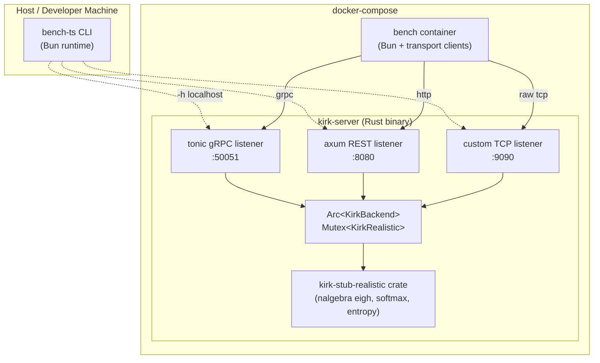

# kirk-stub-rs-multiproto

Rust port of the `kirk-stub-realistic` Python package (v0.2.3) wrapped in a single binary (`kirk-server`) that simultaneously exposes the same six-stage compute pipeline over three transports: gRPC on :50051 (tonic), REST on :8080 (axum), and a custom length-prefixed binary TCP protocol on :9090 (raw tokio). A Bun TypeScript harness (`bench-ts`) drives concurrent virtual users against any of the three transports and produces side-by-side latency/throughput comparisons. The expected throughput ordering, validated by the bench, is TCP > gRPC > REST.

## Quick Start

```
make build
make run
TRANSPORT=tcp make bench-tcp
```

More detailed sequences below.

## Prerequisites

- Rust stable (see `rust-toolchain.toml`; current pin is `stable`)
- `protoc` — required at compile time by `tonic-build`
  - macOS: `brew install protobuf`
  - Debian/Ubuntu: `apt-get install protobuf-compiler`
- Bun 1.x — required for the bench harness (the TCP transport uses `Bun.connect()`)
  - `curl -fsSL https://bun.sh/install | bash`
- Docker + Compose — for the containerized path

## Repository Layout

```
Cargo.toml                   # workspace: [kirk-stub-realistic, kirk-server]
rust-toolchain.toml          # stable toolchain pin
proto/
  kirk.proto                 # single source of truth for gRPC schema
kirk-stub-realistic/
  Cargo.toml
  src/                       # six-stage compute kernel
  tests/
    basic.rs                 # 7 unit tests
    parity.rs                # 4 numerical parity tests vs Python reference
    fixtures/                # JSON fixtures: handcalc_N2, seed42 N8/16/32
  README.md
kirk-server/
  Cargo.toml
  build.rs                   # tonic-build: compiles proto/kirk.proto
  src/
    main.rs                  # runtime builder, listener spawn, --healthcheck
    config.rs                # clap Config struct with all CLI flags
    backend.rs               # Arc<KirkBackend> — Mutex<KirkRealistic>
    shutdown.rs              # broadcast channel + 10 s drain deadline
    metrics.rs               # Prometheus text counters + histograms
    grpc/                    # tonic KirkService implementation
    rest/                    # axum router, JSON schema, base64 helpers
    tcp/                     # framing, per-opcode codec, per-connection handler
  tests/                     # integration tests (TCP, REST, gRPC, cross-transport)
  README.md
bench-ts/
  package.json
  bunfig.toml
  tsconfig.json
  src/
    cli.ts                   # entry point: `run` and `compare` subcommands
    runner.ts                # measurement loop, warmup, latency collection
    compare.ts               # side-by-side result diff
    rng.ts                   # seeded Xoshiro256** (splitmix64 seeded)
    matrix.ts                # MatrixPool — pre-generated circular buffer
    summary.ts               # percentile aggregator, pretty-print
    results.ts               # ResultFile schema + writer
    transports/
      grpc.ts                # @grpc/grpc-js client
      rest.ts                # fetch with HTTP keepalive
      tcp.ts                 # Bun.connect() with req_id pipelining
  results/                   # gitignored output dir
  README.md
docker/
  Dockerfile                 # rust:1-bookworm builder -> distroless/cc-debian12
  Dockerfile.bench           # oven/bun:1-alpine
docker-compose.yml           # kirk-server + bench (bench profile)
Makefile
```

## Usage

### Host (no Docker)

```bash
# Build the server
make build

# Run the server (all three transports, default ports)
make run
# or with explicit options:
cargo run --release -p kirk-server -- --bind 127.0.0.1 --workers 4

# Verify it is up
curl http://localhost:8080/healthz
# {"status":"ok"}

# Install bench dependencies
cd bench-ts && bun install && cd ..

# Benchmark each transport (from repo root)
bun bench-ts/src/cli.ts run --transport tcp  --users 100 --duration 30s --matrix-size 32
bun bench-ts/src/cli.ts run --transport grpc --users 100 --duration 30s --matrix-size 32
bun bench-ts/src/cli.ts run --transport rest --users 100 --duration 30s --matrix-size 32

# Side-by-side comparison
bun bench-ts/src/cli.ts compare bench-ts/results/*.json
```

### Docker Compose

```bash
# Start the server (blocks until healthy)
make up

# Run each transport bench (results land in bench-ts/results/)
make bench-tcp    # TRANSPORT=tcp   USERS=100 DURATION=30s MATRIX_SIZE=32
make bench-grpc   # TRANSPORT=grpc  ...
make bench-rest   # TRANSPORT=rest  ...
make bench-all    # all three back-to-back

# Compare
make compare

# Tear down
make down
```

Or with raw Docker Compose variables:

```bash
docker compose up -d kirk-server
TRANSPORT=tcp  USERS=100 DURATION=30s MATRIX_SIZE=32 docker compose run --rm bench
TRANSPORT=grpc USERS=100 DURATION=30s MATRIX_SIZE=32 docker compose run --rm bench
TRANSPORT=rest USERS=100 DURATION=30s MATRIX_SIZE=32 docker compose run --rm bench
bun bench-ts/src/cli.ts compare bench-ts/results/*.json
```

## Architecture



All three listeners share one `Arc<KirkBackend>` which holds a `parking_lot::Mutex<KirkRealistic>`. The mutex is held only for the rolling-window update (microseconds); the eigendecomposition is off the critical path for `N < 128` (inline on the tokio thread) and dispatched to `spawn_blocking` for `N >= 128`.

## Transport Wire-Format Reference

| Transport | Port  | Protocol                       | Max message |
|-----------|-------|--------------------------------|-------------|
| gRPC      | 50051 | HTTP/2 + protobuf (tonic 0.12) | 64 MiB      |
| REST      | 8080  | HTTP/1.1 + JSON (axum 0.7)     | 64 MiB      |
| TCP       | 9090  | custom 16-byte LE header + raw f32 | 64 MiB  |

See `kirk-server/README.md` for the full TCP byte-level specification and the REST JSON envelope shapes.

## Numerical Parity

The Rust pipeline matches the Python `numpy` reference within:

| Metric | Tolerance |
|--------|-----------|
| `entropy`, `entropy_re`, `entropy_im` | relative error `<= 1e-4` |
| `confidence` | absolute error `<= 1e-4` |
| density matrix `rho` (Frobenius) | `||rho_rs - rho_py||_F / ||rho_py||_F <= 1e-3` |

To reproduce, run the parity tests against the pre-generated fixtures:

```bash
cargo test -p kirk-stub-realistic --test parity
```

To regenerate fixtures from the Python reference:

```bash
cd /Users/charmalloc/dev/kavara/kirk-stub-realistic
uv run --python 3.13 python /tmp/gen_fixtures.py
```

The `eigenvector sign` is not compared (gauge ambiguity); only `rho = V D V†` is compared.

## Security Posture

This server has no authentication and no TLS. It is designed to run behind a reverse proxy (nginx, envoy, or similar) that terminates TLS and enforces AuthN/AuthZ.

For non-Docker deployments, bind to loopback:

```bash
cargo run --release -p kirk-server -- --bind 127.0.0.1
```

For Docker deployments, port exposure is controlled by the host firewall; the default `--bind 0.0.0.0` is appropriate.

Resource caps (all configurable via CLI flags):

- `--max-matrix-dim` 1..=4096 (default 1024) — hard cap on matrix dimension N
- `--max-connections` 1..=65535 (default 1024) — TCP connection-count semaphore
- `--max-in-flight-per-conn` 1..=65535 (default 128) — per-connection in-flight cap
- `--tcp-write-timeout-ms` 100..=600000 (default 10000) — TCP slow-reader timeout

See `kirk-server/README.md` for the full security flags table.

## Per-Component Documentation

- `kirk-stub-realistic/README.md` — compute pipeline, public API, parity details
- `kirk-server/README.md` — all CLI flags, REST endpoints, gRPC RPCs, TCP byte spec
- `bench-ts/README.md` — bench flags, output JSON schema, pipelining model
- `proto/README.md` — gRPC schema ownership
- `docs/ARCHITECTURE.md` — Mermaid diagrams, sequence diagrams, ADRs

## Development

```bash
# Build
make build

# Test
cargo test --workspace

# Lint
cargo clippy --workspace --all-targets -- -D warnings

# Type-check bench-ts (requires tsc or bun)
cd bench-ts && bun x tsc --noEmit
```

## Out of Scope

- TLS / mTLS — terminate at a proxy
- Authentication / authorization
- Kafka streaming integration (Python `streaming.py` not ported)
- GPU acceleration
- Multi-tenant rolling-window state
