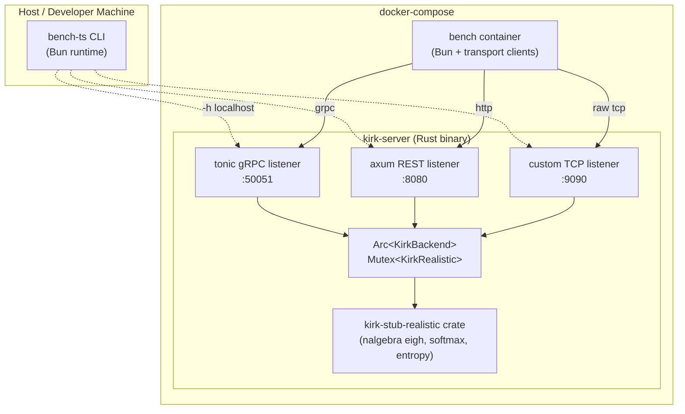
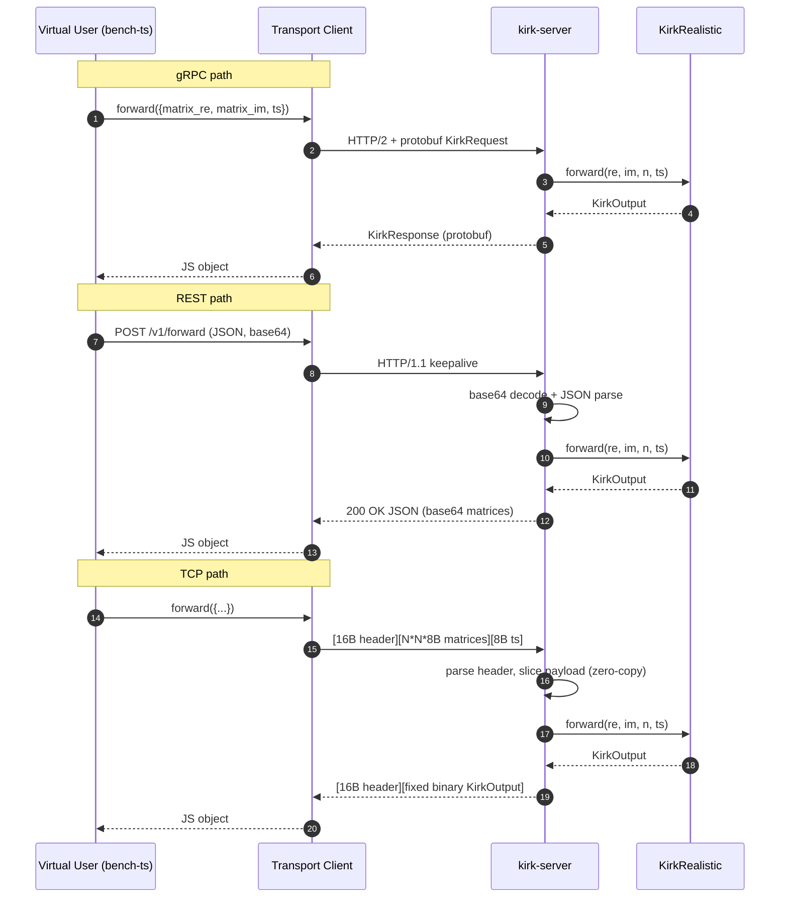
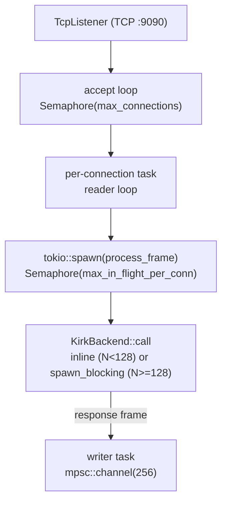
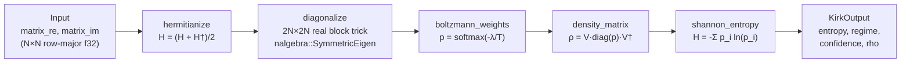

# Architecture

This document consolidates the architecture diagrams, sequence flows, and Architecture Decision Records (ADRs) for the `kirk-stub-rs-multiproto` project.

## System Diagram



## Data Flow — Single Forward Call per Transport



## Concurrency Model



For gRPC and REST, tonic and axum handle concurrency internally via their tokio integration. No custom semaphores are needed on those paths.

## Kernel Pipeline



## Architecture Decision Records

### ADR-001: nalgebra for eigendecomposition

**Status**: Accepted.

**Decision**: Use `nalgebra 0.33`'s `SymmetricEigen` on the real symmetric `2N x 2N` block embedding of the complex Hermitian matrix:
```
[[Re(H), -Im(H)],
 [Im(H),  Re(H)]]
```
Each eigenvalue appears twice; we sort ascending and take every other one (with a `1e-5` relative tolerance gate on paired duplicates).

**Rationale**: Pure Rust, no system LAPACK dependency, builds on a clean machine with only `cargo`. Eigenvalues are correct to `1e-4` relative tolerance vs `numpy.linalg.eigh` at N ∈ {8, 16, 32}; density matrix Frobenius error < `1e-3`.

**Alternative considered**: `ndarray-linalg` + `openblas-system` — rejected because it adds a C/BLAS system dependency that breaks hermetic builds and the Docker distroless runtime.

**Consequence**: If eigh becomes the measured bottleneck at large N, the interface can be swapped to `faer 0.19` (also pure Rust) with minimal changes.

---

### ADR-002: axum for REST

**Status**: Accepted.

**Decision**: axum 0.7 on hyper 1.

**Rationale**: tonic 0.12 also uses hyper 1 and tower; sharing the dependency tree reduces binary size and avoids running two thread pools on the same machine. axum's ergonomic handler model reduces boilerplate.

**Alternative considered**: actix-web — rejected because it runs its own runtime, which conflicts with the tokio runtime used by tonic and the TCP listener.

---

### ADR-003: tonic for gRPC

**Status**: Accepted.

**Decision**: tonic 0.12 with prost 0.13.

**Rationale**: Standard Rust gRPC library. Integrates cleanly with axum on hyper 1. Generates idiomatic Rust service traits from `kirk.proto` via `tonic-build` in `build.rs`.

---

### ADR-004: Custom binary TCP framing

**Status**: Accepted.

**Decision**: Fixed 16-byte little-endian header (`magic u32 + version u8 + opcode u8 + flags u16 + req_id u32 + payload_len u32`) followed by raw f32 payload. No protobuf, no varints, no per-field tags, no HTTP framing.

**Rationale**: Removes all overhead beyond `read_exact(16)` + `read_exact(payload_len)`. The matrix is borrowed as `&[f32]` via `f32::from_le_bytes` with no per-element decode. Response encoding is similarly direct. The `req_id` field enables pipelining (multiple in-flight requests per connection) without requiring head-of-line ordering.

**Consequences**:
- Not human-debuggable (binary format)
- Little-endian only — explicitly documented (all target platforms: macOS arm64, linux amd64)
- Future evolution requires a new opcode or version bump

---

### ADR-005: Bun for the bench harness

**Status**: Accepted.

**Decision**: Bun 1.x TypeScript.

**Rationale**: Bun's `fetch` and `Bun.connect()` are lower-overhead than Node equivalents. Fast startup. TypeScript without a compile step. `@grpc/grpc-js` runs on Bun via the Node compatibility layer.

**Fallback**: If `@grpc/grpc-js` shows Bun incompatibility, switch to `@connectrpc/connect-node` (pure JS, no native deps) for the gRPC transport.

---

### ADR-006: Docker Compose service shape

**Status**: Accepted.

**Decision**: Two services: `kirk-server` (long-lived, restart on failure) and `bench` (under the `bench` profile, does not auto-start). Results bind-mounted to host `bench-ts/results/`.

**Rationale**: Server stays up across multiple bench runs, eliminating cold-start noise. `docker compose run --rm bench` is parameterized via env vars (`TRANSPORT`, `USERS`, `DURATION`, `MATRIX_SIZE`, `OP`).

---

### ADR-007: spawn_blocking threshold

**Status**: Accepted.

**Decision**: `kirk-server` offloads eigendecomposition to `tokio::task::spawn_blocking` when `N >= 128`. For `N < 128`, eigh runs inline on the tokio thread.

**Rationale**: For `N < 128`, eigh completes in sub-millisecond time and the tokio reactor can absorb it without noticeable latency impact. For `N >= 128`, eigh can take 10+ ms and would starve the reactor, increasing tail latency for other concurrent requests.

**Consequence**: One extra context switch per request at large N (acceptable; eigh dominates).
